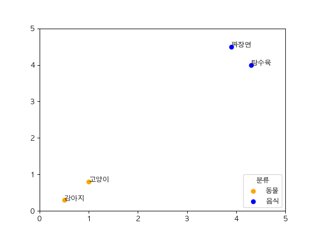

import "katex/dist/katex.min.css";

## 바로가기

### &nbsp; &nbsp; &nbsp; &nbsp;[AI 자기소개 챗봇 만들기 - 1. 전처리(현재 글)](#서론)
### &nbsp; &nbsp; &nbsp; &nbsp;[AI 자기소개 챗봇 만들기 - 2. 모델 구현]()
### &nbsp; &nbsp; &nbsp; &nbsp;[AI 자기소개 챗봇 만들기 - 3. Django 배포]()

---

## 서론

&nbsp;&nbsp;최근 화제가 되고 있는 Open AI의 ChatGPT를 사용해 보니 자연어 처리(NLP)에 관심을 갖게 되었습니다.
비록 ChatGPT에 견주지는 못 하더라도 제가 원하는 결과를 도출 할 수 있는 자연어 처리 모델을 직접 구축해 보고 이를 이용한 서비스를 구현해 보고 싶었습니다.
따라서 자연어 처리에 적합한 아이디어를 고민 해 본 결과 저의 데이터를 학습해 스스로 자기소개를 할 수 있는 챗봇을 구현하겠다는 아이디어를 떠올리게 되었습니다.

이전에 다른 머신 러닝 기법을 공부 해 본 경험을 바탕으로 학습에 사용할 데이터를 전처리하는 것이 우선이라고 판단했습니다.

NLP에서의 전처리에는 어떠한 기법 필요한지 "NLP 전처리", "자연어 처리 전처리" 등의 키워드로 자료를 조사해 보았습니다. 조사 결과 NLP에서 데이터를 전처리 하기 위해서는 토큰화(Tokenization) 작업을 먼저 해야 했습니다. 따라서 데이터의 토큰화를 먼저 진행하기로 계획했습니다.

## 토큰화란?

**토큰화(Tokenization)**가 무엇인지를 알기 위해서는 먼저 **토큰(Token)**이 무엇을 의미하는지 알아야 합니다.
**토큰**이란 의미를 가지는 최소의 단위를 말합니다.

예를 들어 "My name is HonGilDong.(나의 이름은 홍길동이다.)"이라는 문장의 의미를 가지는 최소 단위를 추출 해 보면 `My(나의)`, `name(이름)`, `is(이다)`, `HosGilDong(홍길동)` 의 토큰들을 추출 할 수 있습니다.

이렇듯 문장에서 **토큰**을 추출해 내는 작업을 **토큰화**라 합니다.
직관적으로 생각해 보면 "문장을 공백과 마침표 기준으로 나누면 토큰화가 되는구나!"라고 생각하기 쉽습니다.

영어는 단어를 기준으로 띄어쓰기를 하기 때문에 `It's => It is`, `Don't => Do not` 등의 몇 가지 예외를 제외하면 대부분의 경우 띄어쓰기와 마침표를 기준으로 토큰화를 진행하면 토큰이 비교적 잘 추출되지만 한국어 문장에서는 상황이 다릅니다.

한국어의 경우에는 조사, 어미 등의 구성 요소가 존재하기 때문에 "나의 이름은 홍길동이다." 라는 한국어 문장을 단순히 공백과 마침표를 기준으로 토큰화 하면<br/>
`나의`, `이름은`, `홍길동이다` 라는 토큰이 추출됩니다.

해당 토큰들을 확인해 보면 `나의`, `이름은` 처럼 명사 뒤에 조사가 붙어있는 토큰을 확인 할 수 있습니다.
이는 같은 명사에도 조사에 따라 의미하는 바가 달라지므로 토큰화가 잘 되었다고 보기 어렵습니다.

한국어 문법에는 **"형태소"**가 존재합니다.<br/>
국립 국어원에 따르면 형태소란 "뜻을 가진 가장 작은 말의 단위" 라고 합니다.<br/>
위에서 토큰의 의미가 "의미를 가진 가장 작은 단위"라고 하였습니다.<br/>
이를 통해 "토큰은 곧 형태소를 의미한다"라는 것을 알 수 있습니다.<br/>
따라서 한국어에서 토큰을 추출하기 위해서는 형태소 토큰화를 진행 해야 합니다.

하지만 형태소 토큰화를 직접 구현하기 위해서는 어미, 조사, 띄어쓰기 등 신경써야 할 부분이 너무 많기 때문에 직접 구현하는 것은 시간 낭비라고 생각했습니다.<br/>
따라서 잘 구현된 형태소 분석기를 찾아보았고 MeCab, KKMA, KoNLPy 등의 패키지를 찾을 수 있었습니다.

다양한 형태소 분석기들이 존재했지만 MeCab이 비교적 빠르고 토큰화를 잘 한다는 여러 자료들에 의해 본 프로젝트에서는 MeCab을 이용해 토큰화를 진행하기로 했습니다.

## MeCab을 이용한 토큰화

MeCab을 사용하기 위해서는 먼저 아래 명령어를 사용해서 라이브러리를 설치 해야 합니다.

```bash
pip install python-mecab-ko
```

설치가 완료되었다면 "나의 이름은 홍길동입니다."라는 문장을 형태소 단위로 토큰화 해 보겠습니다.

```python
from mecab import MeCab
mecab = MeCab()

tokens = mecab.morphs('나의 이름은 홍길동입니다.')
print(tokens)
```

```
결과 : ['나', '의', '이름', '은', '홍길동', '입니다', '.']
```
형태소 단위로 정상적인 토큰화가 진행 된 것을 볼 수 있습니다.
토큰화는 정상적으로 진행 되었지만 컴퓨터는 기본적으로 인간의 언어를 이해 하지 못합니다.
따라서 추출한 토큰들을 컴퓨터가 이해 할 수 있는 숫자로 변환하는 작업을 해 주어야 합니다.

## 임베딩(Embedding)

토큰을 컴퓨터가 이해 할 수 있는 숫자로 변환하는 작업을 해야 한다고 하였는데 이 과정을 **임베딩** 이라고 합니다.

CNN(Convolutional Neural Network)을 이용한 이미지 처리를 먼저 접해본 저는 원-핫 인코딩이라는 방식으로 단어(라벨)를 숫자로 임베딩 할 수 있다는 것을 알고 있었습니다. [원-핫 인코딩이란?](#원핫인코딩)

"강아지", "고양이"라는 토큰들을 원-핫 인코딩 방식으로 표현하면 아래와 같은 테이블을 볼 수 있습니다.

| 토큰 | 원-핫 인코딩 |
|---|---|
| 강아지 | [0, 0, 0, 1] |
| 고양이 | [0, 0, 1, 0] |

원-핫 인코딩은 단어의 존재 유무만을 0과 1로 표현 하기 때문에 단어 간의 유사도 혹은 의미를 전혀 표현하지 못 한다는 문제를 가지고 있습니다.

이를 해결하기 위해서는 어떻게 해야 할까요?

예를 들어 "고양이", "강아지", "짜장면", "탕수육" 이라는 토큰이 있다고 가정하겠습니다.
토큰들을 X, Y축이 있는 2차원 좌표 평면 위에 올려 놓겠습니다.

이 때 비슷한 의미의 토큰들은 가까이 배치하고 비슷하지 않은 의미의 토큰들은 멀리 배치하면 다음과 같은 산점도가 나오게 됩니다.



해당 산점도에서 토큰들의 의미와 좌표값은 임의로 설정한 것이므로 같은 분류의 토큰끼리는 가까이 위치해 있고 다른 분류의 토큰끼리는 멀리 위치해 있다는 사실만을 확인하시면 됩니다.

이제 각 토큰들의 좌표값을 가져와 보면 다음과 같은 벡터가 도출됩니다.

| 토큰 | X좌표 | Y좌표 |
|---|---|---|
| 강아지 | 0.5 | 0.3 |
| 고양이 | 1.0 | 0.8 |
| 탕수육 | 4.3 | 4.0 |
| 짜장면 | 3.9 | 4.5 |

$$
distance=\sqrt{(x_{2}-x_{1})^{2}+(y_{2}-y_{1})^{2}}
$$

두 점 사이의 거리 공식을 이용해 각 토큰의 거리(유사도)를 구해 보겠습니다.
$$
\overline{강아지\cdot 고양이}=\sqrt{(1.0-0.5)^{2}+(0.8-0.3)^{2}}=0.6403...
$$

$$
\overline{강아지\cdot 탕수육}=\sqrt{(4.3-0.5)^{2}+(4.0-0.3)^{2}}=5.3037...
$$

도출된 결과를 통해 "강아지"와 "고양이"의 거리가 "강아지"와 "탕수육" 간의 거리보다 가깝다는 사실을 알 수 있습니다.<br/>
이는 "강아지"와 "고양이" 토큰이 "강아지"와 "탕수육" 토큰보다 유사하다는 것을 의미합니다.

이러한 방식으로 임베딩을 하면 각 단어 간의 관계를 컴퓨터가 이해 할 수 있게 됩니다.

예시에서는 이해하기 편하도록 2차원 좌표 평면 위에 토큰을 배치했지만 실제 모델에서는 더 많은 차원(파라미터)으로 토큰간의 관계를 표현합니다.

다음 글에서는 전처리된 데이터를 이용해 실제로 AI 모델을 구축 해 보는 작업을 하겠습니다.