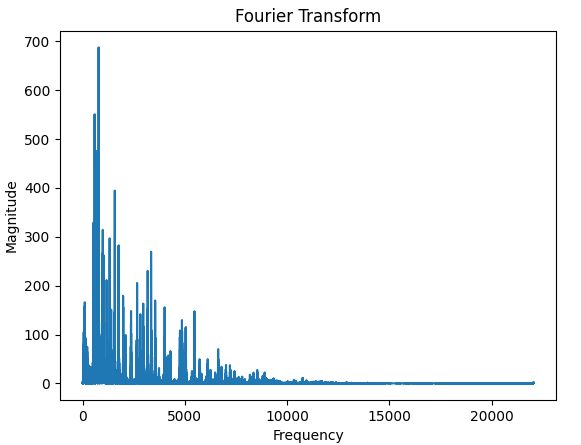
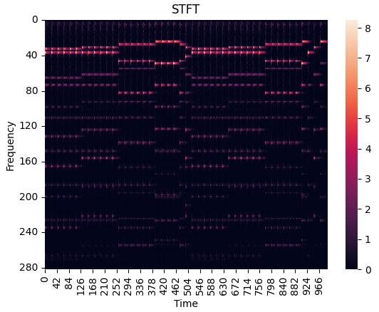
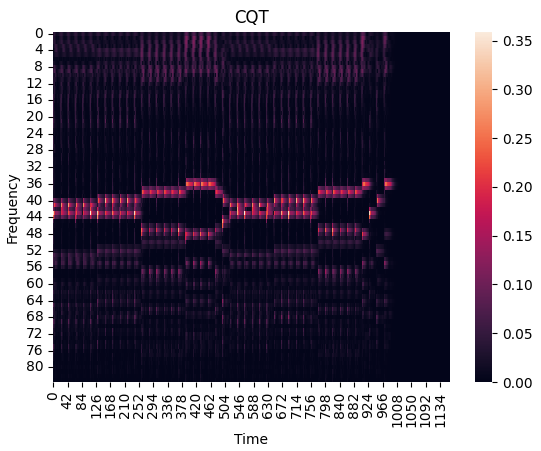
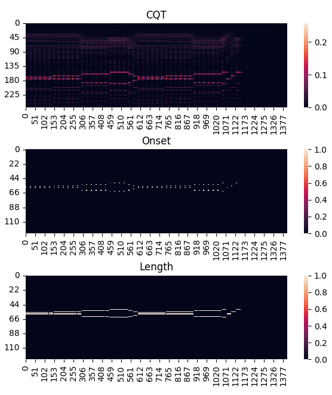

## 바로가기

### &nbsp; &nbsp; &nbsp; &nbsp;[피아노 음악 채보 - 1.전처리(현재 글)](#서론)
### &nbsp; &nbsp; &nbsp; &nbsp;[피아노 음악 채보 - 2.모델 구현](/piano-transcription-model)
### &nbsp; &nbsp; &nbsp; &nbsp;[피아노 음악 채보 - 3.후처리 및 예측](/piano-transcription-postproc)

---

## 서론

피아노 연주를 악보의 형태로 변환하는 작업을 "채보(Transcription)"라 합니다. 기존에는 인간이 직접 연주를 청취하여 악보로 변환하는 방식으로 채보를 하였습니다. 하지만 이는 청취하는 사람에 따라 결과의 정확도가 천차만별일 뿐 아니라 많은 시간이 소요되는 방식이었습니다.

AI 모델을 학습하여 채보를 진행한다면 인간에 비해 적은 시간 소요로 비교적 높은 정확도를 달성 할 수 있습니다.

따라서 본 프로젝트에서는 피아노 연주(WAV, MP3)를 입력 받아 컴퓨터가 연주 할 수 있는 형태인 MIDI 형태로 변환할 수 있는 채보 모델을 학습시키고자 합니다.

---

## 데이터셋 확보

AI 모델을 학습하기 위한 첫 단계는 데이터를 확보하는 일입니다.

데이터셋을 조사하기에 앞서 데이터셋의 기준을 설정하였습니다.

1. 피아노 오디오를 채보할 것 이므로, 다른 악기의 오디오는 포함되지 않음
2. 입력 데이터, 정답 데이터가 필요하므로, 오디오와 악보 데이터가 동시에 존재

상기한 조건을 만족하는 데이터셋을 조사해 본 결과 아래와 같이 3종류의 데이터셋을 찾을 수 있었습니다.

1. [YAMAHA MIDI 데이터셋](http://www.kuhmann.com/Yamaha.htm)
2. [MAPS 데이터셋](https://adasp.telecom-paris.fr/resources/2010-07-08-maps-database/)
3. [Magenta MAESTRO 데이터셋](https://magenta.tensorflow.org/datasets/maestro)

YAMAHA MIDI 데이터셋은 피아노 연주를 MIDI 파일의 형태로 제공하여 해당 MIDI 파일을 오디오 파일로 변환하는 작업이 필요합니다.

MAPS 데이터셋은 음악의 연주가 아닌 단일 음과 다중 음에 대한 데이터셋입니다.
전체 음악에 대한 데이터가 아니므로 각 데이터의 길이가 짧아 음악의 긴 패턴을 학습하기에는 부족해 보였습니다.

마지막으로 Magenta MAESTRO 데이터셋은 MIDI 파일과 WAV 파일을 모두 제공해 주었고, 전체 음악에 대한 데이터이므로 음악의 긴 패턴을 학습하기에도 적합해 보였습니다.

따라서 본 프로젝트에서는 Magenta프로젝트의 MAESTRO 데이터셋을 이용하기로 했습니다.

---

## 전처리 방식 분석

모델에 공급할 데이터셋을 확보하였으므로 데이터의 전처리 과정을 거쳐야 합니다.

데이터셋의 전처리 과정을 위한 데이터를 분석해 보겠습니다.

소리는 진동으로 인해 발생하는 파형으로 표현되며, 이 파형은 여러 다른 주파수의 파장들이 서로 어우러져 하나의 복합 신호를 형성합니다. 이러한 복합 신호를 디지털화 하여 저장한 것이 WAV, MP3 등의 오디오 파일입니다.

이론적으로는 모델이 이러한 복합 신호를 직접 처리할 수 있어야 하지만, 프로토타입 모델의 구현 결과 다양한 주파수, 진폭, 위상 등의 파형 구성이 다양하기 때문에 복합 신호의 모든 패턴을 학습하기는 어려웠습니다.

이러한 문제를 해결하기 위해 원본 복합 신호를 구성하는 파형을 추출하고 이를 모델에 입력 데이터로 사용하는 전처리 과정의 필요성을 느끼게 되었고, 복합 신호에서 각각의 구성 파형을 추출할 수 있는 기법을 조사해 보았습니다.

### Fourier Transform

원본 데이터에서 파형을 추출하는 방법 중 하나로 푸리에 변환(Fourier Transform)이 존재합니다.

푸리에 변환은 복합 신호를 구성하는 파형들을 추출 할 수 있는 변환 기법입니다. 푸리에 변환을 사용하면 원본 신호에서 구성 파형을 추출할 수 있지만, 각 파형의 시간 정보를 잃어버린다는 문제가 존재합니다.

"젓가락 행진곡" 오디오 데이터를 이용하여 푸리에 변환을 시각화 해 보겠습니다.

해당 오디오 파일은 아래의 재생 버튼을 클릭하여 직접 들어 볼 수 있습니다.

<iframe width="100%" height="166" scrolling="no" frameborder="no" allow="autoplay" src="https://w.soundcloud.com/player/?url=https%3A//api.soundcloud.com/tracks/1620578010&color=%23ff5500&auto_play=false&hide_related=false&show_comments=true&show_user=true&show_reposts=false&show_teaser=true"></iframe><div style="font-size: 10px; color: #cccccc;line-break: anywhere;word-break: normal;overflow: hidden;white-space: nowrap;text-overflow: ellipsis; font-family: Interstate,Lucida Grande,Lucida Sans Unicode,Lucida Sans,Garuda,Verdana,Tahoma,sans-serif;font-weight: 100;"><a href="https://soundcloud.com/user48602683" title="user48602683" target="_blank" style="color: #cccccc; text-decoration: none;">user48602683</a> · <a href="https://soundcloud.com/user48602683/chopsticks" title="Chopsticks" target="_blank" style="color: #cccccc; text-decoration: none;">Chopsticks</a></div>

아래 이미지는 "젓가락 행진곡" 오디오를 푸리에 변환한 이미지입니다.



이미지를 확인해 보면 복합 신호에서 구성 주파수들을 추출하였지만 시간 정보는 잃어버린 것을 볼 수 있습니다.

피아노 채보를 위해서는 시간의 흐름에 따라 연주되는 파형을 음표의 형태로 변환해야 하므로 시간 정보를 보존하는 것은 필수적입니다.

따라서 푸리에 변환은 해당 프로젝트에 적합하지 않다고 결론 내렸습니다.

### STFT

푸리에 변환이 시간 정보를 잃어버린다는 문제를 해결하기 위한 기법이 STFT입니다. STFT(Short Time Fourier Transform)는 전체 신호를 작은 시간 단위(Frame)로 나누어서 각 시간 단위에 대한 푸리에 변환을 수행합니다. 따라서 주파수 정보와 시간 정보를 동시에 보존 할 수 있습니다.

아래의 이미지는 "젓가락 행진곡"을 STFT를 이용해 스펙트로그램으로 변환한 이미지입니다.



상기하였듯 시간 정보를 유지하며 시간에 따른 주파수를 올바르게 추출하는 것을 확인 할 수 있습니다.

### CQT

시간 정보를 유지하며 구성 주파수를 추출하는 또 다른 기법으로 CQT(Constant-Q Transform)이 존재합니다. CQT(Constant-Q Transform)는 주파수 대역을 로그 스케일로 나누어 변환하는 방법입니다. 이 방법은 주파수 대역을 고정된 비율(로그 스케일)로 분할하여 각 시간 단위에 대한 주파수 성분을 추출하여 주파수 정보와 시간 정보를 모두 보존할 수 있습니다.

아래의 이미지는 "젓가락 행진곡"을 CQT를 이용해 스펙트로그램으로 변환한 이미지입니다.



CQT와 STFT의 이미지를 비교하면 알 수 있듯 CQT가 고조파(Harmonic)에 비교적 강한 특성을 보였기 때문에 해당 프로젝트에서는 CQT를 이용한 주파수 추출 방식을 채택하였습니다.

---

## 데이터 전처리 수행

전처리 방식을 선택하였으므로 데이터셋의 WAV파일과 MIDI 데이터를 Numpy 배열로 변환하여야 합니다.

librosa 라이브러리는 오디오 신호 처리를 위한 라이브러리로, 푸리에 변환, STFT, CQT 등의 작업을 비교적 쉽게 수행할 수 있게 해 줍니다. 해당 프로젝트에서는 librosa 라이브러리를 이용하여 전처리를 수행하겠습니다.

CQT 변환을 위해서는 시간, 주파수 단위 각각의 해상도를 지정해야 합니다.

### 시간 해상도

CQT에서 시간 해상도는 SR(Sample Rate)와 Hop Length에 의해 결정됩니다.

일반적으로 사용되는 SR은 44100이지만, 연산 비용과 성능을 고려해 16000으로 WAV 파일을 다운샘플링 하였습니다.

또한 HOP_LENGTH를 160으로 설정하여 0.01초 단위의 시간 해상도를 가지게 하였습니다.

### 주파수 해상도

CQT에서 주파수 해상도는 bins에 의해 결정됩니다.

하나의 옥타브는 총 12개의 음으로 구성되므로, 하나의 음을 3개의 bins를 이용해 표현하기 위해 bins_per_octave를 36으로 설정하였습니다.

또한 피아노는 총 88개의 건반을 가지므로 264(3 * 88)의 n_bins를 설정하여 주파수 해상도를 설정하였습니다.

### 타겟 데이터 전처리

모델에 공급하기 위한 입력 데이터의 전처리를 마쳤으므로, 모델이 예측할 타겟 데이터를 생성해야 합니다.

해당 프로젝트에서는 Onset(음의 시작 지점)과 Length(음이 유지되는 동안의 길이)를 예측하고자 하였기 때문에 Onset과 Length에 대한 타겟 데이터를 각각 생성해야 합니다.

기본적으로 데이터셋의 MIDI파일을 88개의 건반으로 나누어 원-핫 인코딩을 수행하여 (오디오 시간, 88) 형태의 Numpy 배열로 변환하여 저장하는 것은 두 방식이 동일합니다.

Length 데이터의 경우에는 Onset 이후 해당 음이 끝나기 까지를 1로 지정 하였으며, 음이 연주되지 않을 때는 0으로 지정하였습니다.

반면에 Onset 데이터는 음이 시작 된 이후로 고정된 시간만큼 감지하기를 원했기 때문에 음의 시작점부터 고정 시간 까지를 1로 지정하였습니다.

### 전처리 시각화

상기한 전처리 과정을 "젓가락 행진곡"을 이용해 시각화하면 다음 그림과 같습니다.



이미지를 확인해 보면 Onset 데이터는 고정된 시간 만큼 처리되었고, Length 데이터는 해당 음의 종료 시점까지의 길이만큼 처리 된 것을 확인 할 수 있습니다.

### 배치 분할

오디오 데이터의 용량이 상당하므로 한번에 모든 데이터를 모델에 공급하는 것은 불가능하므로 데이터를 분할하여 모델에 공급해야 합니다.

해당 프로젝트에서는 전처리한 데이터들을  100개의 고정된 타임스텝으로 분할하여 (오디오 시간, 264), (오디오 시간, 88) 형태의 원본 데이터를 (오디오 시간 / 100, 100, 264), (오디오 시간 / 100, 100, 88)의 형태로 변환하였습니다.

이는 0.01초 단위의 데이터를 100개씩 묶어 모델에 공급한다는 의미로, 한 번에 1초의 데이터를 공급하겠다는 의미입니다.

### 전처리 코드

위에서 설명한 CQT 변환부터 배치 분할까지의 전처리 과정을 코드로 작성하면 다음과 같으며, 데이터를 병렬로 처리하여 전체 데이터 처리 시간을 줄이기 위해 멀티 프로세싱을 사용하였습니다.

<details markdown="1">
<summary>코드 보기(preprocess.py)</summary>

```javascript
import glob
from os import makedirs
from os.path import join, exists, split
from multiprocessing import Process

import matplotlib.pyplot as plt
import seaborn as sns
import librosa
import note_seq
import numpy as np

MIDI_paths, MP3_paths = [], []
VAL_MIDI_paths, VAL_MP3_paths = [], []

def preprocess_wave_and_midi(MIDI_path, x_path, x_save_path, onset_save_path, offsets_save_path):
    # 파일 로드, CQT 변환
    y, sr = librosa.load(x_path, sr=16000)
    cqt = librosa.cqt(y, sr=sr, fmin=librosa.midi_to_hz(21), n_bins=264, hop_length=160, bins_per_octave=36)
    cqt = np.abs(cqt)
    cqt = cqt.T

    cqt = np.pad(cqt, ((0, 10), (0, 0)), mode='constant')

    # 빈 결과 배열 생성
    onset = np.zeros((cqt.shape[0], 88))
    offset = np.zeros((cqt.shape[0], 88))

    # 패딩
    one_seq = 100
    pad_size = one_seq - (cqt.shape[0] % one_seq)
    cqt = np.pad(cqt, ((0, pad_size), (0, 0)), mode='constant')
    onset = np.pad(onset, ((0, pad_size), (0, 0)), mode='constant')
    offset = np.pad(offset, ((0, pad_size), (0, 0)), mode='constant')

    # MIDI 노트 순회
    ns = note_seq.midi_file_to_sequence_proto(MIDI_path)
    for i in ns.notes:
        note = i.pitch - 21

        # 온셋 + 길이 시퀀스
        for x in range(int(i.start_time * 100), int(i.start_time * 100) + 4):
            onset[x, note] = 1

        # 오프셋 시퀀스
        for x in range(int(i.start_time * 100), int(i.end_time * 100)):
            offset[x, note] = 1

    # 크기 변환
    cqts = cqt.reshape(cqt.shape[0] // one_seq, one_seq, 264)
    onsets = onset.reshape(onset.shape[0] // one_seq, one_seq, 88)
    offsets = offset.reshape(offset.shape[0] // one_seq, one_seq, 88)

    # 전처리 데이터 저장
    name = split(x_path)[-1][:-4]
    np.save(join(x_save_path, name), cqts)
    np.save(join(onset_save_path, name), onsets)
    np.save(join(offsets_save_path, name), offsets)

def createDirectory(directory):
    if not exists(directory):
        makedirs(directory)

# 멀티프로세스
def singleProcess(MIDI, MP3, saveX, saveONSET, saveOFFSET):
    for a, b in zip(MIDI, MP3):
        preprocess_wave_and_midi(a, b, saveX, saveONSET, saveOFFSET)

# 데이터셋 여러 프로세스로 나누어 처리
def main(midi_dir, valid_midi_dir, save_path):
    createDirectory(join(save_path, 'trainX'))
    createDirectory(join(save_path, 'validX'))
    createDirectory(join(save_path, 'trainONSET'))
    createDirectory(join(save_path, 'validONSET'))
    createDirectory(join(save_path, 'trainOFFSET'))
    createDirectory(join(save_path, 'validOFFSET'))

    for name in glob.glob(midi_dir):
        MIDI_paths.append(name)
        MP3_paths.append(name[:-4] + "wav")

    for name in glob.glob(valid_midi_dir):
        VAL_MIDI_paths.append(name)
        VAL_MP3_paths.append(name[:-4] + "wav")

    train_len = len(MIDI_paths) // 4
    Process(target=singleProcess, args=(MIDI_paths[:train_len], MP3_paths[:train_len], join(save_path, 'trainX'), join(save_path, 'trainONSET'), join(save_path, 'trainOFFSET'))).start()
    Process(target=singleProcess, args=(MIDI_paths[train_len:2 * train_len], MP3_paths[train_len:2 * train_len], join(save_path, 'trainX'), join(save_path, 'trainONSET'), join(save_path, 'trainOFFSET'))).start()
    Process(target=singleProcess, args=(MIDI_paths[2 * train_len:3 * train_len], MP3_paths[2 * train_len:3 * train_len], join(save_path, 'trainX'), join(save_path, 'trainONSET'), join(save_path, 'trainOFFSET'))).start()
    Process(target=singleProcess, args=(MIDI_paths[3 * train_len:], MP3_paths[3 * train_len:], join(save_path, 'trainX'), join(save_path, 'trainONSET'), join(save_path, 'trainOFFSET'))).start()

    valid_len = len(VAL_MIDI_paths) // 2
    Process(target=singleProcess, args=(VAL_MIDI_paths[:valid_len], VAL_MP3_paths[:valid_len], join(save_path, 'validX'), join(save_path, 'validONSET'), join(save_path, 'validOFFSET'))).start()
    Process(target=singleProcess, args=(VAL_MIDI_paths[valid_len:], VAL_MP3_paths[valid_len:], join(save_path, 'validX'), join(save_path, 'validONSET'), join(save_path, 'validOFFSET'))).start()

if __name__ == '__main__':
    main('../Data/train/*.midi', '../Data/valid/*.midi', '../PreProc')
```
</details>

---

## 마무리

모델에 공급하기 위한 데이터의 전처리를 완료하였으므로, 다음 글에서는 사용할 모델의 아키텍쳐 선정과 실제 모델 구현에 대한 글을 작성 해 보겠습니다.