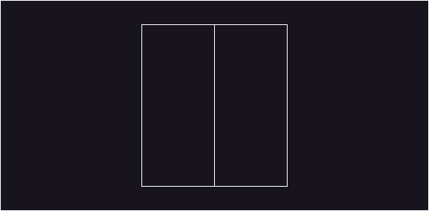

## 문제

### <a href="https://boj.kr/11726" target="_blank">BOJ 11726 2×n 타일링</a>

2×n 크기의 직사각형을 1×2, 2×1 타일로 채우는 방법의 수를 구하는 프로그램을 작성하시오.

아래 그림은 2×5 크기의 직사각형을 채운 한 가지 방법의 예이다.


---

## 입력

첫째 줄에 n이 주어진다. (1 ≤ n ≤ 1,000)

---

## 풀이

해당 문제는 2×N 크기의 직사각형을 1×2, 2×1 크기의 타일들로 채우는 방법의 수를 구하는 문제이다.

이 문제는 DP(Dynamic Programming)를 활용하여 해결 할 수 있다. N=1일 경우부터 N=3인 경우까지를 각각 그림으로 살펴보자.

먼저 N=1인 경우를 생각해 보면 1×2 타일 하나로 직사각형을 채울 수 있으므로 방법의 수는 1이다.
이를 그림으로 나타내면 다음과 같다.


다음으로 N=2인 경우에는 1×2 타일을 2개 사용하거나 2×1 타일 2개 사용하여 직사각형을 채울 수 있으므로 방법의 수는 2이다.




마지막으로 N=3인 경우를 살펴 보면 N=2인 직사각형에 1×2 타일 하나를 추가하는 경우와 N=1인 직사각형에 2×1 타일 2개를 추가하는 경우를 고려할 수 있다.

따라서 점화식은 다음과 같다.

```
dp[N] = dp[N-1] + dp[N-2]
```

찾아낸 점화식을 코드로 구현하면 해당 문제를 해결 할 수 있다.

<details markdown="1">
<summary>코드 보기(Java)</summary>

```javascript
import java.io.*;

public class Main {
    static int[] dp;

    public static void main(String[] args) throws IOException {
        BufferedReader br = new BufferedReader(new InputStreamReader(System.in));

        int N = Integer.parseInt(br.readLine());
        dp = new int[N + 2];
        dp[1] = 1;

        System.out.print(recursive(N + 1));
    }

    static int recursive(int n) {
        if(n <= 1) return dp[n];

        if(dp[n] == 0) {
            dp[n] = recursive(n - 1) + recursive(n - 2);
            dp[n] %= 10007;
        }

        return dp[n];
    }
}
```
</details>

<details markdown="1">
<summary>코드 보기(C++)</summary>

```cpp
#include <iostream>

#define fastio ios_base::sync_with_stdio(false); cin.tie(nullptr); cout.tie(nullptr)
#define endl '\n'

using namespace std;

int main() {
    fastio;
    
    // 테스트 개수 케이스 입력
    int N;
    cin >> N;
    
    for (int i = 0; i < N; i++) {
        int M; // 학생 수
        cin >> M;
        
        int scores[M];

        int count = 0;
        double total = 0, avg = 0;
        for (int j = 0; j < M; j++) { // 1번 ~ 마지막까지 점수 배열에 넣고 총합 구하기
            cin >> scores[j];
            total += scores[j];
        }

        // 평균 구하기
        avg = total / M;

        // 평균을 넘는 학생 수 세기
        for (int j = 0; j < M; j++) {
            if (scores[j] > avg) count++;
        }
        
        std::cout<<fixed;
        cout.precision(3);
        
        // 평균 넘는 학생 수 퍼센트 구하고 출력
        cout << 100.0 * ((double)count / (double)M) << "%" << endl;
    }
    
    return 0;
}
```
</details>

<details markdown="1">
<summary>코드 보기(Kotlin)</summary>

```javascript
fun main(args: Array<String>) = with(System.`in`.bufferedReader()) {
    // 테스트 개수 케이스 입력
    var N = readLine().toInt()
    for (i in 0 until N) {
        var s = readLine().split(" ") // 테스트 케이스 한 줄 입력
        var M = s[0].toInt() // 학생 수
        var scores = Array<Int>(M, {0})

        var count = 0
        var total: Double = 0.0
        var avg: Double = 0.0
        
        for (j in 1 until M + 1) { // 1번 ~ 마지막까지 점수 배열에 넣고 총합 구하기
            scores[j - 1] = s[j].toInt()
            total += scores[j - 1]
        }

        // 평균 구하기
        avg = total / M

        // 평균을 넘는 학생 수 세기
        for (j in 0 until M) {
            if (scores[j] > avg) count++
        }

        // 평균 넘는 학생 수 퍼센트 구하고 출력
        println(String.format("%.3f%%", 100.0 * (count.toDouble() / M.toDouble())))
    }
}
```
</details>

<details markdown="1">
<summary>코드 보기(Python)</summary>

```python
from sys import stdin

def main():
    # 테스트 개수 케이스 입력
    N = int(stdin.readline())
    for i in range(N):
        s = stdin.readline().split(' ') # 테스트 케이스 한 줄 입력
        M = int(s[0]) # 학생 수
        scores = [0] * M

        count = 0
        total = 0.0
        avg = 0.0

        # 1번 ~ 마지막까지 점수 배열에 넣고 총합 구하기
        for j in range(1, M + 1):
            scores[j - 1] = int(s[j])
            total = total + scores[j - 1]

        # 평균 구하기
        avg = total / M

        # 평균을 넘는 학생 수 세기
        for j in range(M):
            if scores[j] > avg:
                count = count + 1

        # 평균 넘는 학생 수 퍼센트 구하고 출력
        res = 100.0 * (float(count) / float(M))
        print(f"{res:.3f}%")

if __name__ == "__main__":
    main()
```
</details>

<details markdown="1">
<summary>코드 보기(Swift)</summary>

```cpp
import Foundation

func main() {
    // 테스트 개수 케이스 입력
    var N = Int(readLine()!)!
    for i in 0..<N {
        var s = readLine()!.split(separator: " ") // 테스트 케이스 한 줄 입력
        var M = Int(s[0])! // 학생 수
        var scores = [Int](repeating: 0, count: M)

        var count = 0
        var total: Double = 0.0
        var avg: Double = 0.0

        // 1번 ~ 마지막까지 점수 배열에 넣고 총합 구하기
        for j in 1..<M+1 {
            scores[j - 1] = Int(s[j])!
            total = total + Double(scores[j - 1])
        }
        
        // 평균 구하기
        avg = total / Double(M)

        // 평균을 넘는 학생 수 세기
        for j in 0..<M {
            if Double(scores[j]) > avg {
                count = count + 1
            }
        }
            
        // 평균 넘는 학생 수 퍼센트 구하고 출력
        var res = 100.0 * (Double(count) / Double(M))
        print(String(format: "%.3f%%", res))
    }
}

main()
```
</details>