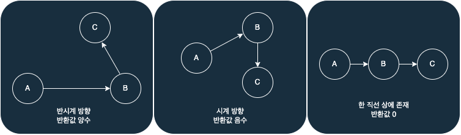
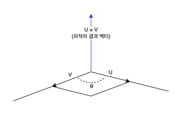

import "katex/dist/katex.min.css";

## 문제

### <a href="https://boj.kr/11758" target="_blank">BOJ 11758 CCW 바로 가기</a>

2차원 좌표 평면 위에 있는 점 3개 P1, P2, P3가 주어진다.<br/>
P1, P2, P3를 순서대로 이은 선분이 어떤 방향을 이루고 있는지 구하는 프로그램을 작성하시오.

---

## 입력

첫째 줄에 P1의 (x1, y1), 둘째 줄에 P2의 (x2, y2), 셋째 줄에 P3의 (x3, y3)가 주어진다.<br/>
(-10,000 ≤ x1, y1, x2, y2, x3, y3 ≤ 10,000) 모든 좌표는 정수이다.<br/>
P1, P2, P3의 좌표는 서로 다르다.

---

## 풀이

해당 문제는 제목부터 CCW로, CCW 알고리즘 구현을 요구하는 문제이다.

CCW(Counter Clock Wise) 알고리즘은 평면상에 존재하는 세 점의 방향성 판별 알고리즘으로 A, B, C 순으로 점을 이었을 때 <span style="color: red;">반시계</span> 방향이면 <span style="color: red;">양수</span>, <span style="color: green;">하나의 직선</span> 상에 존재하면 <span style="color: green;">0</span>, <span style="color: blue;">시계 방향</span>이면 <span style="color: blue;">음수</span>값을 반환한다.



두 벡터 U, V를 외적하면 결과 벡터는 아래의 이미지와 같이 U, V벡터가 이루는 평행사변형에 수직한 방향으로 나온다.



이때 두 벡터 사이의 각도 $\theta$에 따라 결과 벡터의 방향의 부호가 결정되게 된다. $\theta$의 범위별 방향의 부호는 다음과 같다.

| 범위 | 결과 벡터 부호 |
|---|---|
| 0 < $\theta$ < 180 | 양의 방향 |
| 180 < $\theta$ < 360 | 음의 방향 |
| $\theta$ = 0 or $\theta$ = 180 | 0 |

CCW 알고리즘은 이러한 외적의 원리를 이용해 세 점의 방향성을 판별한다.
 
외적에 대해 알고 있는 사람들은 외적은 2차원인 평면에서는 성립하지 않는 것 아닌가? 라는 의문을 가질 수 있다.
 
두 벡터의 Z축을 0으로 설정하게 되면 두 벡터는 여전히 하나의 평면에 존재 하지만 3차원으로 표현할 수 있다.

쉽게 말하면 수학적으로 평면상에서의 외적은 불가능하기 때문에 Z축에 0을 설정해 2차원에서 3차원으로 변환을 한 것이다.

그럼 CCW 알고리즘을 위한 공식을 유도해 보자.

벡터를 외적하기 위해서는 먼저 A, B, C점으로부터 AB, AC의 벡터를 구해야 한다.
각 벡터를 구하기 위한 공식은 다음과 같다.(차원의 변환을 위해 Z축은 0으로 설정한다.)

$$
\overrightarrow{AB} = (Bx - Ax, By - Ay, 0)\newline
\overrightarrow{AC} = (Cx - Ax, Cy - Ay, 0)
$$

$\overrightarrow{AB}$, $\overrightarrow{AB}$ 벡터를 구했으므로 두 벡터를 외적해 보겠다.
두 벡터를 외적하기 위한 공식은 다음과 같다.

$$
U = (Ux, Uy, Uz), V = (Vx, Vy, Vz)\newline
U \times V = (UyVz - UzVy, UzVx - UxVz, UxVy - UyVx)
$$

위의 공식으로 $\overrightarrow{AB}$, $\overrightarrow{AC}$ 벡터를 외적하면 다음과 같은 결과 벡터를 얻을 수 있다.

$$
\overrightarrow{AB} \times \overrightarrow{AC} = (0, 0, (Bx - Ax)(Cy - Ay) - (Cy - Ay)(Bx - Ax))
$$

$\overrightarrow{AB}$, $\overrightarrow{AC}$ 벡터는 XY축 기준으로 표현 되었기 때문에 결과 벡터의 Z축의 부호에 따라 방향이 결정된다.

따라서 CCW를 구현하기 위한 공식은 다음과 같다.

$$
(Bx - Ax)(Cy - Ay) - (Cy - Ay)(Bx - Ax)
$$

유도된 공식을 이용해 CCW를 구현하면 문제를 풀어낼 수 있다.

하지만 입력되는 좌표의 범위가 (-10,000 ≤ 좌표 ≤ 10,000) 이므로 해당 식을 계산하는 도중 int값을 초과하는 경우가 발생한다.

유도된 공식을 아래와 같이 전개하고 나눠서 계산하면 int값을 초과하는 문제를 해결 할 수 있다.

$$
Ax \times By + Bx \times Cy + Cx \times Ay - (Ay \times Bx + By \times Cx + Cy \times Ax)
$$

<details markdown="1">
<summary>코드 보기(Java)</summary>

```javascript
import java.io.*;

public class Main {
    // 하나의 점을 저장하기 위한 클래스
    static class Point {
        int x, y;

        public Point(int x, int y) {
            this.x = x;
            this.y = y;
        }
    }

    public static void main(String[] args) throws Exception {
        BufferedReader br = new BufferedReader(new InputStreamReader(System.in));

        // 3개의 점 저장 할 배열 생성
        Point[] points = new Point[3];

        // 점의 좌표를 입력받아 배열에 저장
        for(int i = 0; i < 3; i++) {
            String[] info = br.readLine().split(" ");
            points[i] = new Point(Integer.parseInt(info[0]), Integer.parseInt(info[1]));
        }
        
        // CCW 알고리즘을 통해 판별후 결과 출력
        int res = CCW(points[0], points[1], points[2]);
        if(res == 0) System.out.println("0");
        else if(res > 0) System.out.println("1");
        else System.out.println("-1");
    }

    // CCW 알고리즘 구현(음수 - 시계 방향, 0 - 한 직선, 양수 - 반시계 방향)
    static int CCW(Point p1, Point p2, Point p3) {
        int S = p1.x * p2.y + p2.x * p3.y + p3.x * p1.y;
        S -= p1.y * p2.x + p2.y * p3.x + p3.y * p1.x;

        return S;
    }
}
```
</details>

<details markdown="1">
<summary>코드 보기(C++)</summary>

```cpp
#include <iostream>

#define fastio ios_base::sync_with_stdio(false); cin.tie(nullptr); cout.tie(nullptr)
#define endl '\n'

using namespace std;
typedef pair<int, int> point;

// CCW 알고리즘 구현(음수 - 시계 방향, 0 - 한 직선, 양수 - 반시계 방향)
int CCW(point p1, point p2, point p3) {
    int S = p1.first * p2.second + p2.first * p3.second + p3.first * p1.second;
    S -= p1.second * p2.first + p2.second * p3.first + p3.second * p1.first;

    return S;
}

int main() {
    fastio;
    
    // 3개의 점 저장 할 배열 생성
    point points[3];
    
    // 점의 좌표를 입력받아 배열에 저장
    for(int i = 0; i < 3; i++) {
        int x, y;
        cin >> x >> y;
        points[i] = point(x, y);
    }
    
    // CCW 알고리즘을 통해 판별후 결과 출력
    int res = CCW(points[0], points[1], points[2]);
    if(res == 0) cout << "0" << endl;
    else if(res > 0) cout << "1" << endl;
    else cout << "-1" << endl;
    
    return 0;
}
```
</details>

<details markdown="1">
<summary>코드 보기(Kotlin)</summary>

```javascript
import java.util.*

// 하나의 점을 저장하기 위한 클래스
class Point(x: Int, y: Int) {
    var x = x
    var y = y
}

// CCW 알고리즘 구현(음수 - 시계 방향, 0 - 한 직선, 양수 - 반시계 방향)
fun CCW(p1: Point, p2: Point, p3: Point): Int {
    var S = p1.x * p2.y + p2.x * p3.y + p3.x * p1.y
    S = S - (p1.y * p2.x + p2.y * p3.x + p3.y * p1.x)

    return S
}

fun main(args: Array<String>) {
    // 3개의 점 저장 할 배열 생성
    var points = ArrayList<Point>()
    
    // 점의 좌표를 입력받아 배열에 저장
    for (i in 0 until 3) {
        var info = readLine()!!.split(" ")
        points += Point(info[0].toInt(), info[1].toInt())
    }
    
    // CCW 알고리즘을 통해 판별후 결과 출력
    var res = CCW(points[0], points[1], points[2]);
    if (res == 0) {
        println("0")
    } else if (res > 0) {
        println("1")
    } else {
        println("-1")
    }
}
```
</details>

<details markdown="1">
<summary>코드 보기(Python)</summary>

```python
from sys import stdin

# 하나의 점을 저장하기 위한 클래스
class Point:
    def __init__(self, x, y):
        self.x = x
        self.y = y

# CCW 알고리즘 구현(음수 - 시계 방향, 0 - 한 직선, 양수 - 반시계 방향)
def CCW(p1, p2, p3):
    S = p1.x * p2.y + p2.x * p3.y + p3.x * p1.y
    S -= p1.y * p2.x + p2.y * p3.x + p3.y * p1.x

    return S

def main():
    # 3개의 점 저장 할 배열 생성
    points = []
    
    # 점의 좌표를 입력받아 배열에 저장
    for i in range(3):
        info = stdin.readline().split(' ')
        points.append(Point(int(info[0]), int(info[1])))
    
    # CCW 알고리즘을 통해 판별후 결과 출력
    res = CCW(points[0], points[1], points[2])
    if res == 0:
        print("0")
    elif res > 0:
        print("1")
    else:
        print("-1")
        
if __name__ == "__main__":
    main()
```
</details>

<details markdown="1">
<summary>코드 보기(Swift)</summary>

```cpp
import Foundation

// 하나의 점을 저장하기 위한 클래스
class Point {
    var x: Int
    var y: Int
    
    init(x: Int, y: Int) {
        self.x = x
        self.y = y
    }
}

// CCW 알고리즘 구현(음수 - 시계 방향, 0 - 한 직선, 양수 - 반시계 방향)
func CCW(p1: Point, p2: Point, p3: Point)-> Int {
    var S = p1.x * p2.y + p2.x * p3.y + p3.x * p1.y
    S = S - (p1.y * p2.x + p2.y * p3.x + p3.y * p1.x)

    return S
}

func main() {
    // 3개의 점 저장 할 배열 생성
    var points = Array<Point>()
    
    // 점의 좌표를 입력받아 배열에 저장
    for i in 0..<3 {
        var info = readLine()!.split(separator: " ")
        points.append(Point(x: Int(info[0])!, y: Int(info[1])!))
    }
    
    // CCW 알고리즘을 통해 판별후 결과 출력
    var res = CCW(p1: points[0], p2: points[1], p3: points[2]);
    if res == 0 {
        print("0")
    } else if res > 0 {
        print("1")
    } else {
        print("-1")
    }
}

main()
```
</details>