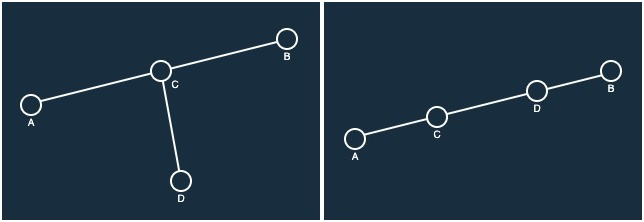
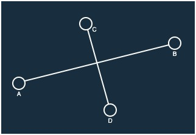

import "katex/dist/katex.min.css";

## 문제

### <a href="https://boj.kr/17386" target="_blank">BOJ 17386 선분 교차 1 바로 가기</a>

2차원 좌표 평면 위의 두 선분 L1, L2가 주어졌을 때, 두 선분이 교차하는지 아닌지 구해보자.

L1의 양 끝 점은 (x1, y1), (x2, y2), L2의 양 끝 점은 (x3, y3), (x4, y4)이다.

---

## 입력

첫째 줄에 L1의 양 끝 점 x1, y1, x2, y2가, 둘째 줄에 L2의 양 끝 점 x3, y3, x4, y4가 주어진다. 세 점이 일직선 위에 있는 경우는 없다.

---

## 풀이

두 개의 선분이 주어졌을 때 이 두 선분이 교차하는지 판별하는 문제이다.

본 문제는 CCW 알고리즘을 응용하여 해결할 수 있는 문제로 CCW 알고리즘에 대한 선행 학습이 필요하다.

CCW 알고리즘에 대한 개념과 원리는 이전 게시글 <a href="https://boj.kr/11758" target="_blank">BOJ 11758 CCW</a>에 작성해 두었다.

선분 L1의 양 끝 점을 각각 A, B로 두고 L2의 양 끝 점을 C, D로 가정하고 가능한 경우를 확인해 보자.

문제의 제약 조건 중 "세 점이 일직선 위에 있는 경우는 없다."라고 하였다.
이 말은 곧 "세 점의 CCW 결과가 0인 값은 존재하지 않는다." 라는 말과 같다.

이로 인해 다음 그림과 같은 경우들은 존재 할 수 없게 된다.



위와 같은 경우들이 불가능하므로 두 선분이 교차하기 위해서는 아래의 그림과 같이 양 끝 점을 제외한 선분의 내부에서 만나야 한다는 것을 알 수 있다.



위의 그림을 잘 살펴 보면 선분 AB 관점에서 점 C, D를 CCW 하였을 때 각각 반시계, 시계 방향이 나온다는 것을 알 수 있다.
CCW(A, B, C) = 1, CCW(A, B, D) = -1를 만족한다는 것이다.

CCW(A, B, C) = 1, CCW(A, B, D) = -1은 결국 "선분 AB를 기준으로 좌측에는 점 C가, 우측에는 점 D가 존재해야 한다."라는 말이 된다.
이는 다시 말해 "선분 AB는 점 C, D 사이에 존재해야 한다."라는 말과 같다.

그러나 위의 그림만 보면 CCW(A, B, C) = 1, CCW(A, B, D) = -1을 만족하는 경우에는 반드시 선분이 교차할 것 같지만 아쉽게도 반례가 존재한다.

 CCW(A, B, C) = 1, CCW(A, B, D) = -1을 만족하지만 교차하지 않는 반례는 아래 그림과 같다.


이러한 반례를 해결하기 위해서는 선분 CD 관점에서도 CCW를 진행하면 된다.

선분 AB가 점 C, D 사이에 존재해야 했듯, 선분 CD 또한 점 A, B 사이에 존재해야 두 선분이 교차할 수 있기 때문이다.

따라서 [CCW(A, B, C), CCW(A, B, D)], [CCW(C, D, A), CCW(C, D, B)]를 고려해야 한다는 사실을 알 수 있다.

또한 위의 고려사항들을 우리말로 풀어 정리하면 "선분 AB는 점 C, D 사이에 존재해야 하고, 선분 CD는 점 A, B 사이에 존재해야 한다."가 된다.

이는 우리가 직관적으로 생각하는 선분의 교차 조건과 일치한다.

<details markdown="1">
<summary>코드 보기(Java)</summary>

```javascript
import java.io.*;

public class Main {
    // 하나의 점을 저장하기 위한 클래스
    static class Point {
        long x, y;

        public Point(long x, long y) {
            this.x = x;
            this.y = y;
        }
    }

    public static void main(String[] args) throws Exception {
        BufferedReader br = new BufferedReader(new InputStreamReader(System.in));

        // 2개 선분의 시작점과 끝점을 입력받음
        Point[] points = new Point[4];
        for(int i = 0; i < 4; i += 2) {
            String[] info = br.readLine().split(" ");
            points[i] = new Point(Long.parseLong(info[0]), Long.parseLong(info[1]));
            points[i + 1] = new Point(Long.parseLong(info[2]), Long.parseLong(info[3]));
        }

        // 선분 AB와 점 C, D를 CCW
        int abc = CCW(points[0], points[1], points[2]);
        int abd = CCW(points[0], points[1], points[3]);

        // 선분 CD와 점 A, B를 CCW
        int cda = CCW(points[2], points[3], points[0]);
        int cdb = CCW(points[2], points[3], points[1]);

        // CCW의 결과가 {양수, 음수}이므로 곱하면 음수가 되어야 함
        if(abc * abd < 0 && cda * cdb < 0) System.out.println("1");
        else System.out.println("0");
    }

    // CCW 알고리즘 구현(수가 커질 수 있으므로 long을 이용함)
    static int CCW(Point p1, Point p2, Point p3) {
        long S = p1.x * p2.y + p2.x * p3.y + p3.x * p1.y;
        S -= p1.y * p2.x + p2.y * p3.x + p3.y * p1.x;

        if(S < 0) return 1;
        return -1;
    }
}
```
</details>

<details markdown="1">
<summary>코드 보기(C++)</summary>

```cpp
#include <iostream>

#define fastio ios_base::sync_with_stdio(false); cin.tie(nullptr); cout.tie(nullptr)
#define endl '\n'

using namespace std;
typedef pair<long, long> point;

// CCW 알고리즘 구현(수가 커질 수 있으므로 long을 이용함)
int CCW(point p1, point p2, point p3) {
    long S = p1.first * p2.second + p2.first * p3.second + p3.first * p1.second;
    S -= p1.second * p2.first + p2.second * p3.first + p3.second * p1.first;
    
    if(S < 0) return 1;
    return -1;
}

int main() {
    fastio;
    
    // 2개 선분의 시작점과 끝점을 입력받음
    point points[4];
    for(int i = 0; i < 4; i += 2) {
        long x1, y1, x2, y2;
        cin >> x1 >> y1 >> x2 >> y2;
        points[i] = point(x1, y1);
        points[i + 1] = point(x2, y2);
    }

    // 선분 AB와 점 C, D를 CCW
    int abc = CCW(points[0], points[1], points[2]);
    int abd = CCW(points[0], points[1], points[3]);

    // 선분 CD와 점 A, B를 CCW
    int cda = CCW(points[2], points[3], points[0]);
    int cdb = CCW(points[2], points[3], points[1]);

    // CCW의 결과가 {양수, 음수}이므로 곱하면 음수가 되어야 함
    if(abc * abd < 0 && cda * cdb < 0) cout << "1" << endl;
    else cout << "0" << endl;
    
    return 0;
}
```
</details>

<details markdown="1">
<summary>코드 보기(Kotlin)</summary>

```javascript
import java.util.*;

// 하나의 점을 저장하기 위한 클래스
class Point(x: Long, y: Long) {
    var x = x
    var y = y
}

// CCW 알고리즘 구현(수가 커질 수 있으므로 long을 이용함)
fun CCW(p1: Point, p2: Point, p3: Point): Int {
    var S = p1.x * p2.y + p2.x * p3.y + p3.x * p1.y
    S = S - (p1.y * p2.x + p2.y * p3.x + p3.y * p1.x)
    
    if (S < 0) return 1
    return -1
}

fun main(args: Array<String>) {
    // 2개 선분의 시작점과 끝점을 입력받음
    var points = ArrayList<Point>()
    for(i in 0 until 2) {
        var info = readLine()!!.split(" ")
        points += Point(info[0].toLong(), info[1].toLong());
        points += Point(info[2].toLong(), info[3].toLong());
    }

    // 선분 AB와 점 C, D를 CCW
    var abc = CCW(points[0], points[1], points[2]);
    var abd = CCW(points[0], points[1], points[3]);

    // 선분 CD와 점 A, B를 CCW
    var cda = CCW(points[2], points[3], points[0]);
    var cdb = CCW(points[2], points[3], points[1]);

    // CCW의 결과가 {양수, 음수}이므로 곱하면 음수가 되어야 함
    if(abc * abd < 0 && cda * cdb < 0) println("1");
    else println("0");
}
```
</details>

<details markdown="1">
<summary>코드 보기(Python)</summary>

```python
from sys import stdin

# 하나의 점을 저장하기 위한 클래스
class Point:
    def __init__(self, x, y):
        self.x = x
        self.y = y

# CCW 알고리즘 구현
def CCW(p1, p2, p3):
    S = p1.x * p2.y + p2.x * p3.y + p3.x * p1.y
    S -= p1.y * p2.x + p2.y * p3.x + p3.y * p1.x
    
    if S < 0:
        return 1
    return -1

def main():
    # 2개 선분의 시작점과 끝점을 입력받음
    points = []
    for i in range(2):
        info = stdin.readline().split(' ')
        points.append(Point(int(info[0]), int(info[1])))
        points.append(Point(int(info[2]), int(info[3])))

    # 선분 AB와 점 C, D를 CCW
    abc = CCW(points[0], points[1], points[2])
    abd = CCW(points[0], points[1], points[3])

    # 선분 CD와 점 A, B를 CCW
    cda = CCW(points[2], points[3], points[0])
    cdb = CCW(points[2], points[3], points[1])

    # CCW의 결과가 {양수, 음수}이므로 곱하면 음수가 되어야 함
    if abc * abd < 0 and cda * cdb < 0:
        print("1")
    else:
        print("0")
        
if __name__ == "__main__":
    main()
```
</details>

<details markdown="1">
<summary>코드 보기(Swift)</summary>

```cpp
import Foundation

// 하나의 점을 저장하기 위한 클래스
class Point {
    var x: Int
    var y: Int
    
    init(x: Int, y: Int) {
        self.x = x
        self.y = y
    }
}

// CCW 알고리즘 구현
func CCW(p1: Point, p2: Point, p3: Point)-> Int {
    var S = p1.x * p2.y + p2.x * p3.y + p3.x * p1.y
    S = S - (p1.y * p2.x + p2.y * p3.x + p3.y * p1.x)
    
    if S < 0 {
        return 1
    }
    
    return -1
}

func main() {
    // 2개 선분의 시작점과 끝점을 입력받음
    var points = Array<Point>()
    for i in 0..<2 {
        var info = readLine()!.split(separator: " ")
        points.append(Point(x: Int(info[0])!, y: Int(info[1])!))
        points.append(Point(x: Int(info[2])!, y: Int(info[3])!))
    }
    
    // 선분 AB와 점 C, D를 CCW
    var abc = CCW(p1: points[0], p2: points[1], p3: points[2])
    var abd = CCW(p1: points[0], p2: points[1], p3: points[3])

    // 선분 CD와 점 A, B를 CCW
    var cda = CCW(p1: points[2], p2: points[3], p3: points[0])
    var cdb = CCW(p1: points[2], p2: points[3], p3: points[1])
    
    // CCW의 결과가 {양수, 음수}이므로 곱하면 음수가 되어야 함
    if abc * abd < 0 && cda * cdb < 0 {
        print("1")
    } else {
        print("0")
    }
}

main()
```
</details>