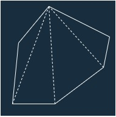
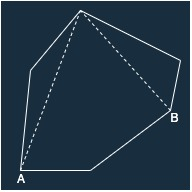

## 문제

### <a href="https://boj.kr/2166" target="_blank">BOJ 2166 다각형의 면적 바로 가기</a>

2차원 평면상에 N(3 ≤ N ≤ 10,000)개의 점으로 이루어진 다각형이 있다.<br/>
이 다각형의 면적을 구하는 프로그램을 작성하시오.

---

## 입력

첫째 줄에 N이 주어진다. 다음 N개의 줄에는 다각형을 이루는 순서대로 N개의 점의 x, y좌표가 주어진다.<br/>
좌표값은 절댓값이 100,000을 넘지 않는 정수이다.

---

## 풀이

본 문제는 CCW를 응용하여 해결할 수 있다.<br/>
따라서 CCW에 대한 개념 학습이 선행되어야 한다.<br/>
CCW에 대한 내용은 [BOJ 11758 CCW](https://jeong-jun.su/boj11758)에 정리해 두었다.

다각형은 아래의 그림과 같이 여러개의 삼각형으로 나눌 수 있다.



그림을 통해 나눠진 삼각형 면적의 합은 다각형의 면적과 같다는 사실을 알 수 있다.

CCW에 대해 설명한 글에서 벡터에 외적을 하면 두 벡터가 이루는 평행사변형의 면젹이 나온다고 하였으므로, 평행사변형의 면적을 2로 나누어 삼각형의 면적을 구할 수 있다.

따라서 하나의 점을 기준으로 삼고, 서로 다른 두 점과 CCW 한 값의 절반을 누적하면 다각형의 면적을 구할 수 있다.

이때 서로 다른 두 점을 인접한 두 점으로 선택해야 한다.

아래 그림과 같이 인접하지 않은 두 점 A, B를 선택하면 삼각형이 형성되지 않을 수 있기 때문이다.



본 문제에서는 "다각형을 이루는 순서대로" 점의 좌표가 주어진다고 하였으므로 순차적으로 반복하면 인접한 점을 지날 수 있다.

위의 예시를 보다보면 삼각형이 다각형 내부에 형성되지 않는 경우에도 해당 풀이가 성립하는지에 대한 의문이 생긴다.

삼각형이 다각형 내부에 형성되지 않는 경우에 대한 예시 그림은 아래와 같다.


이러한 경우에는 

<details markdown="1">
<summary>코드 보기(Java)</summary>

```javascript
import java.io.*;

public class Main {
    // 하나의 점을 저장할 클래스
    static class Point {
        long x, y;

        public Point(long x, long y) {
            this.x = x;
            this.y = y;
        }
    }

    // CCW 알고리즘 구현
    static double CCW(Point p1, Point p2, Point p3) {
        double S = p1.x * p2.y + p2.x * p3.y + p3.x * p1.y;
        S -= p1.y * p2.x + p2.y * p3.x + p3.y * p1.x;

        return S / 2;
    }

    public static void main(String[] args) throws Exception {
        BufferedReader br = new BufferedReader(new InputStreamReader(System.in));

        // 점의 개수 입력 받음
        int N = Integer.parseInt(br.readLine());
        Point[] points = new Point[N];

        // 각 점의 좌표 입력 받음
        for (int i = 0; i < N; i++) {
            String[] s = br.readLine().split(" ");
            points[i] = new Point(Integer.parseInt(s[0]), Integer.parseInt(s[1]));
        }

        // CCW를 통해 다각형 면적 누적
        double res = 0;
        for(int i = 1; i < N; i++) {
            res += CCW(points[0], points[i - 1], points[i]);
        }

        System.out.println(String.format("%.1f", Math.abs(res)));
    }
}
```
</details>

<details markdown="1">
<summary>코드 보기(C++)</summary>

```cpp
#include <iostream>
#include <stack>

#define fastio ios_base::sync_with_stdio(false); cin.tie(nullptr); cout.tie(nullptr)
#define endl '\n'

using namespace std;

int main() {
    fastio;
    
    stack<int> stk;

    // 고도 변화 지점의 개수 입력
    int N;
    cin >> N;

    int tower = 0; // 건물 개수 저장할 변수
    for (int i = 0; i < N; i++) {
        int nextX, nextY;
        cin >> nextX >> nextY; // 스택에 추가할 고도 입력
        
        // 건물의 끝점인 경우 pop 및 개수 증가
        while(!stk.empty() && stk.top() > nextY) {
            stk.pop();
            tower++;
        }

        if(nextY == 0) {
            // 고도가 0이면 건물 남은 건물 없음
            while(!stk.empty()) stk.pop();
        } else if(stk.empty() || stk.top() < nextY){
            // nextY != 0이고 스택 비었거나, 건물의 시작점일 경우 스택에 추가
            stk.push(nextY);
        }
    }
    
    // 건물 개수와 스택에 남은(끝점이 명시되지 않은) 건물의 합
    cout << tower + stk.size() << endl;
    
    return 0;
}
```
</details>

<details markdown="1">
<summary>코드 보기(Kotlin)</summary>

```javascript
import java.util.*;

fun main(args: Array<String>) {
    var stk = Stack<Int>()

    // 고도 변화 지점의 개수 입력
    var N = readLine()!!.toInt()
    
    var tower = 0  // 건물 개수 저장할 변수
    for (i in 0 until N) {
        var info = readLine()!!.split(" ")
        var nextY = info[1].toInt() // 스택에 추가할 고도 입력

        // 건물의 끝점일 경우 pop 및 개수 증가
        while (stk.isNotEmpty() && stk.peek() > nextY) {
            stk.pop()
            tower += 1
        }

        if (nextY == 0) {
            // 고도가 0이면 남은 건물 없음
            stk.clear()
        } else if (stk.isEmpty() || stk.peek() < nextY) {
            // nextY != 0이고 스택 비었거나, 건물의 시작점일 경우 스택에 추가
            stk.push(nextY)
        }
    }
    
    // 건물 개수와 스택에 남은(끝점이 명시되지 않은) 건물의 합
    print(tower + stk.size)
}
```
</details>

<details markdown="1">
<summary>코드 보기(Python)</summary>

```python
from sys import stdin

def main():
    stk = []

    # 고도 변화 지점의 개수 입력
    N = int(stdin.readline())
    
    tower = 0  # 건물 개수 저장할 변수
    for i in range(N):
        info = stdin.readline().split(' ')
        nextY = int(info[1]) # 스택에 추가할 고도 입력

        # 건물의 끝점일 경우 pop 및 개수 증가
        while stk and stk[-1] > nextY:
            stk.pop()
            tower += 1

        if nextY == 0:
            # 고도가 0이면 남은 건물 없음
            stk.clear()
        elif not stk or stk[-1] < nextY:
            # nextY != 0이고 스택 비었거나, 건물의 시작점일 경우 스택에 추가
            stk.append(nextY)

    # 건물 개수와 스택에 남은(끝점이 명시되지 않은) 건물의 합
    print(tower + len(stk))

if __name__ == "__main__":
    main()
```
</details>

<details markdown="1">
<summary>코드 보기(Swift)</summary>

```cpp
import Foundation

func main() {
    var stk = Array<Int>()

    // 고도 변화 지점의 개수 입력
    var N = Int(readLine()!)!
    
    var tower = 0  // 건물 개수 저장할 변수
    for i in 0..<N {
        var info = readLine()!.split(separator: " ")
        var nextY = Int(info[1])! // 스택에 추가할 고도 입력

        // 건물의 끝점일 경우 pop 및 개수 증가
        while !stk.isEmpty && stk.last! > nextY {
            stk.popLast()
            tower += 1
        }

        if nextY == 0 {
            // 고도가 0이면 남은 건물 없음
            stk.removeAll()
        } else if stk.isEmpty || stk.last! < nextY {
            // nextY != 0이고 스택 비었거나, 건물의 시작점일 경우 스택에 추가
            stk.append(nextY)
        }
    }
    
    // 건물 개수와 스택에 남은(끝점이 명시되지 않은) 건물의 합
    print(tower + stk.count)
}

main()
```
</details>