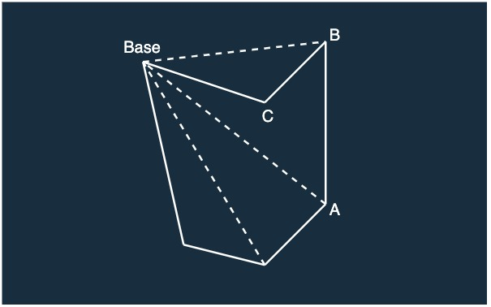

## 문제

### <a href="https://boj.kr/2166" target="_blank">BOJ 2166 다각형의 면적 바로 가기</a>

2차원 평면상에 N(3 ≤ N ≤ 10,000)개의 점으로 이루어진 다각형이 있다.<br/>
이 다각형의 면적을 구하는 프로그램을 작성하시오.

---

## 입력

첫째 줄에 N이 주어진다. 다음 N개의 줄에는 다각형을 이루는 순서대로 N개의 점의 x, y좌표가 주어진다.<br/>
좌표값은 절댓값이 100,000을 넘지 않는 정수이다.

---

## 풀이

본 문제는 CCW를 응용하여 해결할 수 있다.<br/>
따라서 CCW에 대한 개념 학습이 선행되어야 한다.<br/>
CCW에 대한 내용은 [BOJ 11758 CCW](https://jeong-jun.su/boj11758)에 정리해 두었다.

다각형은 아래의 그림과 같이 여러개의 삼각형으로 나눌 수 있다.


그림을 통해 나눠진 삼각형 면적의 합은 다각형의 면적과 같다는 사실을 알 수 있다.

CCW에 대해 설명한 글에서 벡터에 외적을 하면 두 벡터가 이루는 평행사변형의 면젹이 나온다고 하였으므로, 평행사변형의 면적을 2로 나누어 삼각형의 면적을 구할 수 있다.

따라서 하나의 점을 기준으로 삼고, 서로 다른 두 점과 CCW 한 값의 절반을 누적하면 다각형의 면적을 구할 수 있다.

이때 서로 다른 두 점을 인접한 두 점으로 선택해야 한다.

아래 그림과 같이 인접하지 않은 두 점 A, B를 선택하면 삼각형이 형성되지 않을 수 있기 때문이다.


본 문제에서는 "다각형을 이루는 순서대로" 점의 좌표가 주어진다고 하였으므로 순차적으로 반복하면 인접한 점을 지날 수 있다.

위의 예시를 보다보면 삼각형이 다각형 외부에 형성되는 경우에도 해당 풀이가 성립하는지에 대한 의문이 생긴다.

삼각형이 다각형 외부에 형성 되는 경우에 대한 예시 그림은 아래와 같다.



위의 그림과 같은 경우에는 직관적으로 해당 풀이가 성립하지 않는것 같다.

여기서 상기해야 할 사실이 있다. CCW 알고리즘은 부호를 갖는다는 점이다.

이런 사실로 인해 다각형 외부에 삼각형이 형성된 경우에는 다각형 내부에 형성된 삼각형과는 반대의 부호를 가지게 된다.

이는 누적된 면적에서 필요 없는 부분의 면적을 빼는 효과를 가져온다.

위의 그림으로 보면 CCW(Base, A, B)의 면적에서 CCW(Base, B, C)의 면적을 빼야 원하는 다각형의 면적이 도출된다는 것을 알 수 있다.

하지만 부호를 갖는다는 특성으로 인해 최종 결과값이 음수가 될 수 있다는 문제가 발생한다.

최종 결과의 크기는 같지만 부호만 다를 수 있으므로 해당 문제는 절대값을 통해 해결할 수 있다.

지금까지 설명한 풀이를 코드로 구현하면 다음과 같다.

<details markdown="1">
<summary>코드 보기(Java)</summary>

```javascript
import java.io.*;

public class Main {
    // 하나의 점을 저장할 클래스
    static class Point {
        long x, y;

        public Point(long x, long y) {
            this.x = x;
            this.y = y;
        }
    }

    // CCW 알고리즘 구현
    static double CCW(Point p1, Point p2, Point p3) {
        double S = p1.x * p2.y + p2.x * p3.y + p3.x * p1.y;
        S -= p1.y * p2.x + p2.y * p3.x + p3.y * p1.x;

        return S / 2;
    }

    public static void main(String[] args) throws Exception {
        BufferedReader br = new BufferedReader(new InputStreamReader(System.in));

        // 점의 개수 입력 받음
        int N = Integer.parseInt(br.readLine());
        Point[] points = new Point[N];

        // 각 점의 좌표 입력 받음
        for (int i = 0; i < N; i++) {
            String[] s = br.readLine().split(" ");
            points[i] = new Point(Integer.parseInt(s[0]), Integer.parseInt(s[1]));
        }

        // CCW를 통해 다각형 면적 누적
        double res = 0;
        for(int i = 1; i < N; i++) {
            res += CCW(points[0], points[i - 1], points[i]);
        }

        System.out.println(String.format("%.1f", Math.abs(res)));
    }
}
```
</details>

<details markdown="1">
<summary>코드 보기(C++)</summary>

```cpp
#include <iostream>
#include <cmath>

#define fastio ios_base::sync_with_stdio(false); cin.tie(nullptr); cout.tie(nullptr)
#define endl '\n'

using namespace std;
typedef pair<long, long> point;

// CCW 알고리즘 구현
double CCW(point p1, point p2, point p3) {
    double S = p1.first * p2.second + p2.first * p3.second + p3.first * p1.second;
    S -= p1.second * p2.first + p2.second * p3.first + p3.second * p1.first;

    return S / 2;
}

int main() {
    fastio;
    
    // 점의 개수 입력 받음
    int N;
    cin >> N;
    point points[N];

    // 각 점의 좌표 입력 받음
    for (int i = 0; i < N; i++) {
        long x, y;
        cin >> x >> y;
        
        points[i] = point(x, y);
    }

    // CCW를 통해 다각형 면적 누적
    double res = 0;
    for(int i = 1; i < N; i++) {
        res += CCW(points[0], points[i - 1], points[i]);
    }

    // 소수점 첫째 자리까지 반올림
    cout << fixed;
    cout.precision(1);
    cout << abs(res) << endl;
    
    return 0;
}
```
</details>

<details markdown="1">
<summary>코드 보기(Kotlin)</summary>

```javascript
import java.util.*;

// 하나의 점을 저장하기 위한 클래스
class Point(x: Long, y: Long) {
    var x = x
    var y = y
}

// CCW 알고리즘 구현
fun CCW(p1: Point, p2: Point, p3: Point): Double {
    var S = p1.x * p2.y + p2.x * p3.y + p3.x * p1.y
    S = S - (p1.y * p2.x + p2.y * p3.x + p3.y * p1.x)

    return S / 2.0
}

fun main(args: Array<String>) {
    // 점의 개수 입력 받음
    var N = readLine()!!.toInt()
    var points = ArrayList<Point>()
    
    // 각 점의 좌표 입력 받음
    for (i in 0 until N) {
        var s = readLine()!!.split(" ")
        points += Point(s[0].toLong(), s[1].toLong())
    }

    // CCW를 통해 다각형 면적 누적
    var res: Double = 0.0
    for (i in 1 until N) {
        res += CCW(points[0], points[i - 1], points[i])
    }
    
    println(String.format("%.1f", Math.abs(res)))
}
```
</details>

<details markdown="1">
<summary>코드 보기(Python)</summary>

```python
from sys import stdin

# 하나의 점을 저장하기 위한 클래스
class Point:
    def __init__(self, x, y):
        self.x = x
        self.y = y

# CCW 알고리즘 구현
def CCW(p1, p2, p3):
    S = p1.x * p2.y + p2.x * p3.y + p3.x * p1.y
    S -= p1.y * p2.x + p2.y * p3.x + p3.y * p1.x

    return S / 2

def main():
    # 점의 개수 입력 받음
    N = int(input())
    points = []

    # 각 점의 좌표 입력 받음
    for i in range(N):
        s = stdin.readline().split(' ')
        points.append(Point(int(s[0]), int(s[1])))

    # CCW를 통해 다각형 면적 누적
    res = 0
    for i in range(1, N):
        res += CCW(points[0], points[i - 1], points[i])

    # 소수점 첫째 자리까지 반올림
    print(abs(round(res, 1)))

if __name__ == "__main__":
    main()
```
</details>

<details markdown="1">
<summary>코드 보기(Swift)</summary>

```cpp
import Foundation

// 하나의 점을 저장하기 위한 클래스
class Point {
    var x: Int64
    var y: Int64
    
    init(x: Int64, y: Int64) {
        self.x = x
        self.y = y
    }
}

// CCW 알고리즘 구현
func CCW(p1: Point, p2: Point, p3: Point)-> Double {
    var S = p1.x * p2.y + p2.x * p3.y + p3.x * p1.y
    S = S - (p1.y * p2.x + p2.y * p3.x + p3.y * p1.x)

    return Double(S) / 2.0
}

func main() {
    // 점의 개수 입력 받음
    var N = Int(readLine()!)!
    var points = Array<Point>()

    // 각 점의 좌표 입력 받음
    for i in 0..<N {
        var s = readLine()!.split(separator: " ")
        points.append(Point(x: Int64(s[0])!, y: Int64(s[1])!))
    }

    // CCW를 통해 다각형 면적 누적
    var res: Double = 0
    for i in 1..<N {
        res += CCW(p1: points[0], p2: points[i - 1], p3: points[i])
    }

    // 소수점 1번째까지 반올림
    print(abs(round(res * 10) / 10))
}

main()
```
</details>