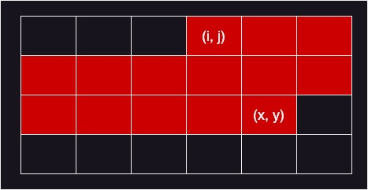
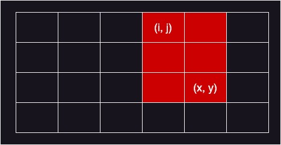

import "katex/dist/katex.min.css";

## 문제

### <a href="https://boj.kr/2167" target="_blank">BOJ 2167 2차원 배열의 합</a>

2차원 배열이 주어졌을 때 (i, j) 위치부터 (x, y) 위치까지에 저장되어 있는 수들의 합을 구하는 프로그램을 작성하시오.<br/>
배열의 (i, j) 위치는 i행 j열을 나타낸다.

---

## 입력

첫째 줄에 배열의 크기 N, M(1 ≤ N, M ≤ 300)이 주어진다.<br/>
다음 N개의 줄에는 M개의 정수로 배열이 주어진다.<br/>
배열에 포함되어 있는 수는 절댓값이 10,000보다 작거나 같은 정수이다.<br/>
그 다음 줄에는 합을 구할 부분의 개수 K(1 ≤ K ≤ 10,000)가 주어진다.<br/>
다음 K개의 줄에는 네 개의 정수로 i, j, x, y가 주어진다(1 ≤ i ≤ x ≤ N, 1 ≤ j ≤ y ≤ M).

---

## 풀이

해당 문제는 2차원 배열에서 주어진 부분 배열의 합을 구하는 문제이다.

하지만 주의해야 할 부분이 있다.

일반적으로 배열의 부분 합을 구할 때에는 아래 그림과 같은 영역의 합을 구할 것이다.



하지만 해당 문제에서 원하는 영역은 아래의 그림과 같은 영역이다.



위의 사실만 주의하며 구현하면 문제를 쉽게 해결할 수 있다.

<details markdown="1">
<summary>코드 보기(Java)</summary>

```javascript
import java.io.*;

public class Main {
    public static void main(String[] args) throws Exception {
        BufferedReader br = new BufferedReader(new InputStreamReader(System.in));
        StringBuilder sb = new StringBuilder();

        // 배열의 크기 입력
        String[] s = br.readLine().split(" ");
        int M = Integer.parseInt(s[0]);
        int N = Integer.parseInt(s[1]);

        // 배열 생성 및 입력
        int[][] arr = new int[M][N];
        for (int i = 0; i < M; i++) {
            s = br.readLine().split(" ");
            for (int j = 0; j < N; j++) arr[i][j] = Integer.parseInt(s[j]);
        }

        // 배열의 합 계산
        int cnt = Integer.parseInt(br.readLine());
        for (int i = 0; i < cnt; i++) {
            s = br.readLine().split(" ");
            int sx = Integer.parseInt(s[0]) - 1, sy = Integer.parseInt(s[1]) - 1;
            int ex = Integer.parseInt(s[2]) - 1, ey = Integer.parseInt(s[3]) - 1;

            int sum = 0;
            for (int j = sx; j <= ex; j++) {
                for (int k = sy; k <= ey; k++) {
                    sum += arr[j][k];
                }
            }

            sb.append(sum + "\n");
        }

        System.out.println(sb);
    }
}
```
</details>

<details markdown="1">
<summary>코드 보기(C++)</summary>

```cpp
#include <iostream>
#include <queue>

#define fastio ios_base::sync_with_stdio(false); cin.tie(nullptr); cout.tie(nullptr)
#define endl '\n'

using namespace std;

int main() {
    fastio;
    
    // 배열의 크기 입력
    int M, N;
    cin >> M >> N;

    // 배열 생성 및 입력
    int arr[M][N];
    for (int i = 0; i < M; i++) {
        for (int j = 0; j < N; j++) {
            cin >> arr[i][j];
        }
    }

    // 배열의 합 계산
    int cnt;
    cin >> cnt;
    for (int i = 0; i < cnt; i++) {
        int sx, sy, ex, ey;
        cin >> sx >> sy >> ex >> ey;
        sx--; sy--; ex--; ey--;

        int sum = 0;
        for (int j = sx; j <= ex; j++) {
            for (int k = sy; k <= ey; k++) {
                sum += arr[j][k];
            }
        }
        
        cout << sum << endl;
    }
    
    return 0;
}
```
</details>

<details markdown="1">
<summary>코드 보기(Kotlin)</summary>

```javascript
fun main(args: Array<String>) = with(System.`in`.bufferedReader()) {
    // 배열의 크기 입력
    var s = readLine().split(" ")
    var M = s[0].toInt()
    var N = s[1].toInt()

    // 배열 생성 및 입력
    var arr = Array(M, {IntArray(N, {0})})
    for(i in 0 until M) {
        s = readLine().split(" ")
        for(j in 0 until N) {
            arr[i][j] = s[j].toInt()
        }
    }

    // 배열의 합 계산
    var cnt = readLine().toInt()
    for(i in 0 until cnt) {
        s = readLine().split(" ")
        var sx = s[0].toInt() - 1
        var sy = s[1].toInt() - 1
        var ex = s[2].toInt() - 1
        var ey = s[3].toInt() - 1
        
        var sum = 0
        for(j in sx..ex) {
            for(k in sy..ey) {
                sum = sum + arr[j][k]
            }
        }
        
        println(sum)
    }
}
```
</details>

<details markdown="1">
<summary>코드 보기(Python)</summary>

```python
from sys import stdin
import heapq

def main():
    # 배열의 크기 입력
    s = stdin.readline().split(" ")
    M = int(s[0])
    N = int(s[1])

    # 배열 생성 및 입력
    arr = [[0 for j in range(N)] for i in range(M)]
    for i in range(0, M):
        s = stdin.readline().split(" ")
        for j in range(0, N):
            arr[i][j] = int(s[j])

    # 배열의 합 계산
    cnt = int(stdin.readline())
    for i in range(0, cnt):
        s = stdin.readline().split(" ")
        sx = int(s[0]) - 1
        sy = int(s[1]) - 1
        ex = int(s[2]) - 1
        ey = int(s[3]) - 1

        sum = 0
        for j in range(sx, ex + 1):
            for k in range(sy, ey + 1):
                sum = sum + arr[j][k]

        print(sum)

if __name__ == "__main__":
    main()
```
</details>

<details markdown="1">
<summary>코드 보기(Swift)</summary>

```cpp
import Foundation

func main() {
    // 배열의 크기 입력
    var s = readLine()!.split(separator: " ")
    var M = Int(s[0])!
    var N = Int(s[1])!

    // 배열 생성 및 입력
    var arr = Array(repeating: Array(repeating: 0, count: N), count: M)
    for i in 0..<M {
        s = readLine()!.split(separator: " ")
        for j in 0..<N {
            arr[i][j] = Int(s[j])!
        }
    }

    // 배열의 합 계산
    var cnt = Int(readLine()!)!
    for i in 0..<cnt {
        s = readLine()!.split(separator: " ")
        var sx = Int(s[0])! - 1
        var sy = Int(s[1])! - 1
        var ex = Int(s[2])! - 1
        var ey = Int(s[3])! - 1
           
        var sum = 0
        for j in sx...ex {
            for k in sy...ey {
                sum = sum + arr[j][k]
            }
        }
           
        print(sum)
    }
}

main()
```
</details>
