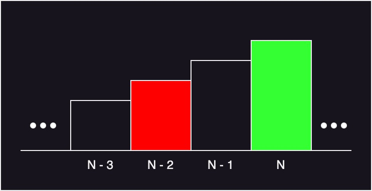

import "katex/dist/katex.min.css";

## 문제

### <a href="https://boj.kr/2579" target="_blank">BOJ 2579 계단 오르기</a>

계단 오르기 게임은 계단 아래 시작점부터 계단 꼭대기에 위치한 도착점까지 가는 게임이다. <그림 1>과 같이 각각의 계단에는 일정한 점수가 쓰여 있는데 계단을 밟으면 그 계단에 쓰여 있는 점수를 얻게 된다.


예를 들어 <그림 2>와 같이 시작점에서부터 첫 번째, 두 번째, 네 번째, 여섯 번째 계단을 밟아 도착점에 도달하면 총 점수는 10 + 20 + 25 + 20 = 75점이 된다.


계단 오르는 데는 다음과 같은 규칙이 있다.

1. 계단은 한 번에 한 계단씩 또는 두 계단씩 오를 수 있다. 즉, 한 계단을 밟으면서 이어서 다음 계단이나, 다음 다음 계단으로 오를 수 있다.
2. 연속된 세 개의 계단을 모두 밟아서는 안 된다. 단, 시작점은 계단에 포함되지 않는다.
3. 마지막 도착 계단은 반드시 밟아야 한다.

따라서 첫 번째 계단을 밟고 이어 두 번째 계단이나, 세 번째 계단으로 오를 수 있다. 하지만, 첫 번째 계단을 밟고 이어 네 번째 계단으로 올라가거나, 첫 번째, 두 번째, 세 번째 계단을 연속해서 모두 밟을 수는 없다.

각 계단에 쓰여 있는 점수가 주어질 때 이 게임에서 얻을 수 있는 총 점수의 최댓값을 구하는 프로그램을 작성하시오.

---

## 입력

입력의 첫째 줄에 계단의 개수가 주어진다.

둘째 줄부터 한 줄에 하나씩 제일 아래에 놓인 계단부터 순서대로 각 계단에 쓰여 있는 점수가 주어진다. 계단의 개수는 300이하의 자연수이고, 계단에 쓰여 있는 점수는 10,000이하의 자연수이다.

---

## 풀이

제약 조건을 만족하며 얻을 수 있는 점수의 최댓값을 구하면 되는 문제이다.

가장 쉽고 직관적으로 문제를 해결하는 방법은 한 계단을 밟았을 경우, 두 계단을 밟았을 경우를 전수 검사하는 방법이다.

하지만 해당 방법은 연산의 중복으로 인해 시간 초과가 발생한다.

이러한 불필요한 연산의 중복을 제거하기 위해 DP(Dynamic Programming)이라는 기법을 사용한다.

DP는 계산된 데이터를 저장 해 두고 필요한 경우 재계산 하지 않고 저장된 데이터에 접근해 이용한다.

N번째 계단을 밟는다고 가정해 보자.

세 개의 계단을 연속으로 밟아서는 안된다고 하였으므로 N번째 계단을 밟을 경우 가능한 경우는 아래 그림과 같다.




해당 그림을 수식으로 나타내면 다음과 같다.

1. (N - 3)번째 계단 까지의 최댓값 + (N - 1)번째 계단의 점수
2. (N - 2)번째 계단 까지의 최댓값

위의 두 값 중 최댓값을 취하고 N번째 계단의 점수를 더하면 N번째 계단을 밟았을 때 점수의 최댓값을 구할 수 있다.

이 때 (N - 3)번째 계단과 (N - 2)번째 계단의 최댓값을 계산하여 별도의 배열에 저장해 두면 불필요한 연산을 줄일 수 있다.

<details markdown="1">
<summary>코드 보기(Java)</summary>

```javascript
import java.io.*;

public class Main {
    static int[] score, memo;

    public static void main(String[] args) throws Exception {
        BufferedReader br = new BufferedReader(new InputStreamReader(System.in));

        // 계단의 개수 입력
        int N = Integer.parseInt(br.readLine());
        score = new int[N];
        memo = new int[N];

        // 계단별 점수 입력
        for(int i = 0; i < N; i++) {
            score[i] = Integer.parseInt(br.readLine());
        }

        memo[0] = score[0]; // 첫 항 설정
        System.out.println(recursive(N - 1)); // 재귀함수 호출
    }

    // DP 수행하는 재귀 함수
    public static int recursive(int n) {
        if(n < 0) return 0; // 음수번째 계단은 없으므로 0 반환
        if(memo[n] != 0) return memo[n]; // 이전에 계산한 값 존재하면 계산 불필요

        int tmp1 = recursive(n - 3) + score[n - 1]; // 3층 이전의 값 + 1층 이전의 값
        int tmp2 = recursive(n - 2); // 2층 이전의 값

        // N번째 계단까지 점수의 최대는 (N - 1)최대 + N번째 계단 점수
        memo[n] = Math.max(tmp1, tmp2) + score[n];

        return memo[n];
    }
}
```
</details>

<details markdown="1">
<summary>코드 보기(C++)</summary>

```cpp
#include <iostream>
#include <algorithm>
#include <vector>
#include <set>

#define fastio ios_base::sync_with_stdio(false); cin.tie(nullptr); cout.tie(nullptr)
#define endl '\n'

using namespace std;

int *score, *memo;

// DP 수행하는 재귀 함수
int recursive(int n) {
    if(n < 0) return 0; // 음수번째 계단은 없으므로 0 반환
    if(memo[n] != 0) return memo[n]; // 이전에 계산한 값 존재하면 계산 불필요

    int tmp1 = recursive(n - 3) + score[n - 1]; // 3층 이전의 값 + 1층 이전의 값
    int tmp2 = recursive(n - 2); // 2층 이전의 값

    // N번째 계단까지 점수의 최대는 (N - 1)최대 + N번째 계단 점수
    memo[n] = max(tmp1, tmp2) + score[n];

    return memo[n];
}

int main() {
    fastio;
    
    // 계단의 개수 입력
    int N;
    cin >> N;
    
    score = new int[N]{0, };
    memo = new int[N]{0, };
    
    // 계단별 점수 입력
    for(int i = 0; i < N; i++) {
        cin >> score[i];
    }

    memo[0] = score[0]; // 첫 항 설정
    cout << recursive(N - 1) << endl; // 재귀함수 호출
    
    return 0;
}
```
</details>

<details markdown="1">
<summary>코드 보기(Kotlin)</summary>

```javascript
lateinit var score: Array<Int>
lateinit var memo: Array<Int>

// DP 수행하는 재귀 함수
fun recursive(n: Int): Int {
    if(n < 0) return 0 // 음수번째 계단은 없으므로 0 반환
    if(memo[n] != 0) return memo[n] // 이전에 계산한 값 존재하면 계산 불필요

    var tmp1 = recursive(n - 3) + score[n - 1] // 3층 이전의 값 + 1층 이전의 값
    var tmp2 = recursive(n - 2) // 2층 이전의 값

    // N번째 계단까지 점수의 최대는 (N - 1)최대 + N번째 계단 점수
    memo[n] = Math.max(tmp1, tmp2) + score[n]

    return memo[n]
}

fun main(args: Array<String>) = with(System.`in`.bufferedReader()) {
    // 계단의 개수 입력
    var N = readLine().toInt()
    
    score = Array<Int>(N, {0})
    memo = Array<Int>(N, {0})
    
    // 계단별 점수 입력
    for(i in 0 until N) {
        score[i] = readLine().toInt()
    }

    memo[0] = score[0] // 첫 항 설정
    println(recursive(N - 1)) // 재귀함수 호출
}
```
</details>

<details markdown="1">
<summary>코드 보기(Python)</summary>

```python
from sys import stdin

score = None
memo = None

# DP 수행하는 재귀 함수
def recursive(n):
    global score, memo

    if n < 0:
        return 0 # 음수번째 계단은 없으므로 0 반환
    if memo[n] != 0:
        return memo[n] # 이전에 계산한 값 존재하면 계산 불필요

    tmp1 = recursive(n - 3) + score[n - 1] # 3층 이전의 값 + 1층 이전의 값
    tmp2 = recursive(n - 2) # 2층 이전의 값

    # N번째 계단까지 점수의 최대는 (N - 1)최대 + N번째 계단 점수
    memo[n] = max(tmp1, tmp2) + score[n]

    return memo[n]

def main():
    # 계단의 개수 입력
    N = int(stdin.readline())

    global score, memo
    score = [0] * N
    memo = [0] * N

    # 계단별 점수 입력
    for i in range(N):
        score[i] = int(stdin.readline())

    memo[0] = score[0]  # 첫 항 설정
    print(recursive(N - 1))  # 재귀함수 호출

if __name__ == "__main__":
    main()
```
</details>

<details markdown="1">
<summary>코드 보기(Swift)</summary>

```cpp
import Foundation

var score: Array<Int>!
var memo: Array<Int>!

// DP 수행하는 재귀 함수
func recursive(n: Int)-> Int {
    if(n < 0) {
        // 음수번째 계단은 없으므로 0 반환
        return 0
    }
    
    if(memo[n] != 0) {
        // 이전에 계산한 값 존재하면 계산 불필요
        return memo[n]
    }

    var tmp1 = recursive(n: n - 3) + score[n - 1] // 3층 이전의 값 + 1층 이전의 값
    var tmp2 = recursive(n: n - 2) // 2층 이전의 값

    // N번째 계단까지 점수의 최대는 (N - 1)최대 + N번째 계단 점수
    memo[n] = max(tmp1, tmp2) + score[n]

    return memo[n]
}

func main() {
    // 계단의 개수 입력
    var N = Int(readLine()!)!
    
    score = Array<Int>(repeating: 0, count: N)
    memo = Array<Int>(repeating: 0, count: N)
    
    // 계단별 점수 입력
    for i in 0..<N {
        score[i] = Int(readLine()!)!
    }

    memo[0] = score[0] // 첫 항 설정
    print(recursive(n: N - 1)) // 재귀함수 호출
}

main()
```
</details>