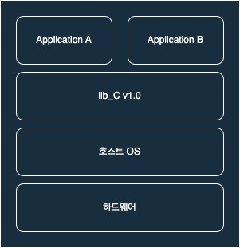
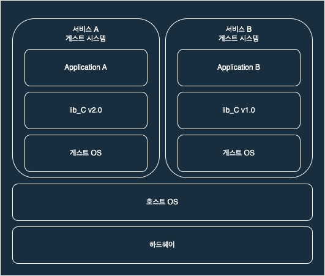
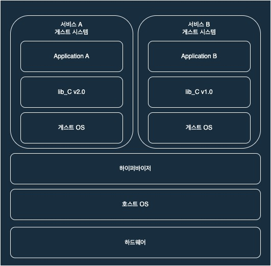
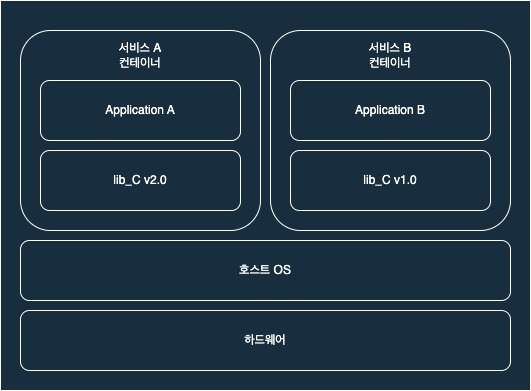

## 서론

필자는 Apache, 메일 서버, 파일 서버, 미디어 서버 등을 이용하기 위해 여분의 사무용 컴퓨터에 리눅스를 설치한 서버를 구축해 사용하였습니다. 별도의 테스트 시스템을 구축하지 못하고 충분한 테스트 과정 없이 라이브 시스템에서 모든 변경 작업을 진행 하다 보니 OS와 응용프로그램이 업데이트 될 때마다 잘 작동하던 응용프로그램에 오류가 발생하거나 오류를 해결하기 위해 설정을 잘못 건드리면서 시스템이 꼬이는 등의 문제가 발생했습니다.

문제를 해결하기 위해 가상화 솔루션을 이용하여 가상 머신에 서비스를 격리시키는 방안을 고려하였고, 서비스를 격리시키면 한 서비스에 문제가 생겨도 해당 가상 머신에서만 수정하면 되기 때문에 다른 서비스와 호스트에는 영향을 주지 않을 것으로 기대 했습니다. 하지만 당시 사용하던 서버에서 여러 개의 가상 머신을 운영 하기에는 성능이 너무 낮았습니다.

성능의 문제로 인해 어쩔 수 없이 가상화를 포기하고 네이티브 서버 운영을 선택했습니다. 그러던 중 Docker를 접하게 되었고, Docker는 다른 가상화 솔루션에 비해 비교적 높은 성능을 제공한다는 평가를 듣게 되었습니다.

실제로 사용해 보니 사용하던 서비스들을 원활히 구동할 수 있을 만큼의 괜찮은 성능을 보여주었습니다.
이러한 경험을 통해 Docker와 기존 가상화 솔루션의 성능 차이에 대한 의문이 생겼고, Docker와 가상화 솔루션의 차이점을 알아보기 위해 자료를 조사하게 되었습니다.

## 가상화란 무엇인가?

Docker에 대해 이야기 하기에 앞서 가상화 기술에 대한 이해가 필요합니다.

먼저, 가상화란 하나의 물리적 시스템을 논리적으로 분할 해 여러 개의 시스템이 존재하는 것 처럼 사용하기 위한 기술입니다.
예를 들어 한 서버에서 A라는 서비스와 B라는 서비스를 실행한다고 가정하겠습니다.
서비스 A와 B는 모두 lib_C 라이브러리 버전 1.0을 이용해 개발되어 하나의 라이브러리를 공유하는 방식으로 서버에 올라가 있을 것 입니다.

그림으로 보면 다음과 같은 구조일 것 입니다.

시간이 지나 lib_C의 버전이 2.0으로 업데이트 되었고, 서비스 A 또한 lib_C의 2.0 버전을 사용하도록 업데이트 되었습니다.
하지만 서비스 B는 아직 lib_C 1.0 버전을 사용하고 있습니다.

이때, 서비스 A를 따라 lib_C의 버전을 2.0으로 업데이트 하면 서비스 B를 사용하지 못 하는 상황이 발생 할 것이고,
서비스 B를 위해 1.0버전을 유지하면 서비스 A의 업데이트를 이용하지 못하는 상황이 발생합니다.

물론 1.0 버전과 2.0 버전을 동시에 설치해서 사용하는 방안이 존재 하겠지만 이는 시스템 관리의 복잡성을 크게 증가시킵니다.

가상화 기술은 하나의 물리적 시스템을 논리적으로 분할해 여러 개의 독립된 시스템이 존재하는 것 처럼 만들어 상기한 문제점을 해결합니다.

A서비스를 사용하기 위한 자원은 게스트A가, B서비스를 사용하기 위한 자원은 게스트B가 각각 가지고 있으며 게스트들 끼리의 자원을 서로 공유하지 못하게 하는 방식으로 격리를 달성합니다.

서비스는 운영체제에도 종속되어 있을 수 있기 때문에 라이브러리는 물론이고 운영체제까지 게스트에 포함시키게 됩니다.
그림으로 보면 다음과 같습니다.

가상화 기술을 이용하면 서비스 A가 업데이트 되어 게스트 A의 라이브러리를 업데이트 한 경우 서비스 B는 게스트 B가 가지고 있는 라이브러리를 이용하므로 A, B 서비스를 독립적으로 운용할 수 있게 됩니다.

이렇게 서비스를 독립적으로 운용할 수 있는 논리적인 시스템을 구축하면 어디서든 해당 시스템만 받아서 실행해 항상 같은 시스템을 실행할 수 있습니다. 이러한 일관성은 개발 환경을 일치시키는데 드는 노력을 줄여 주거나 실제 서비스 중인 환경과 같은 테스트 환경을 제작하는 등의 이점을 제공합니다.

하지만 가상화 기술을 이용하기 위해서는 한 가지의 문제점에 직면하게 됩니다.
호스트와 게스트의 명령어가 다를 경우 정상적인 동작이 불가능해 진다는 것 입니다.
따라서 호스트와 게스트 사이에서 명령어 번역기의 역할을 해 줄 하이퍼바이저(Hypervisor)가 필요하게 됩니다.

하이퍼바이저를 호스트와 게스트 사이에 추가함으로 인해 상호간의 명령어 차이를 극복할 수 있게 되었습니다.
그러나 모든 명령을 하이퍼바이저를 통해 번역 하고 실행하게 되면 기존의 네이티브 시스템보다 필요한 연산이 늘어나기 때문에 성능 저하가 발생 할 수 밖에 없습니다.

하이퍼바이저가 포함된 가상화 기술의 전체 구조를 그림으로 나타내면 다음과 같습니다.

## 가상화 기술 정리

가상화 기술을 이용하면 게스트의 격리를 통해 독립적인 시스템을 운용할 수 있고, 시스템의 일관성을 얻을 수 있다는 장점이 있지만 OS까지도 가상화 시키기 때문에 시스템의 불필요한 중복으로 인한 용량의 증가라는 문제점이 존재합니다.
또한, 게스트의 모든 명령은 하이퍼바이저를 통해 호스트에게 전달되기 때문에 성능 저하가 불가피하다는 문제점 또한 안고 있습니다.

## 컨테이너 기술의 등장

상기한 가상화 기술의 장점을 계승하고, 문제점을 해결하기 위해 컨테이너라는 개념이 등장하게 됩니다.

기존의 가상화 기술이 게스트 내에 서비스에 필요한 어플리케이션, 라이브러리, 심지어 OS까지 가상화 시켰던 것과 달리 컨테이너 기술은 서비스와 서비스에 필요한 환경만을 컨테이너화 하고 격리해 불필요한 중복을 제거하고 다른 컨테이너에 영향을 미치거나 받는 상황을 방지합니다.

또한, 하이퍼바이저와 같은 중간 매개체 없이 호스트의 자원을 게스트가 직접 공유할 수 있게 하여 적은 오버헤드로 자원의 사용을 가능하게 합니다.

위에서 제시했던 예시를 컨테이너화 한 것을 그림으로 그려 보면 아래와 같습니다.

상기한 컨테이너 기술의 특징을 보면 컨테이너 기술은 기존의 가상화 기술에 비해 장점만 존재하고 단점은 존재하지 않는 것 처럼 보입니다.

하지만 여느 기술이 그렇듯 컨테이너 기술 또한 단점이 존재합니다.

먼저, 기존 가상화 기술은 OS까지 가상화 하여 서비스와 호스트의 호환성이 중요하지 않았지만, 컨테이너 기술은 서비스와 서비스에 필요한 환경만을 컨테이너화 하기 때문에 서비스는 반드시 호스트와 호환이 되어야 합니다.

다음으로 호스트의 자원을 직접 공유하여 사용 할 수 있기 때문에 컨테이너의 취약점으로 인해 호스트에 문제가 생길 가능성이 비교적 높습니다. 따라서 호스트와 게스트 사이의 추가적인 보안 대책 마련이 필요합니다.

마지막으로 하나의 시스템에서 실행되는 컨테이너의 수가 증가 할 경우 관리의 복잡성이 늘어난다는 것 입니다.
이로 인해 컨테이너가 많이 필요한 환경에서는 Kubernetes, Docker Swarm 등의 다수 컨테이너들의 배포, 관리, 확장 등을 자동화 해 주는 컨테이너 오케스트레이션 솔루션의 도입을 고려하는 것이 좋습니다.

## Docker란 무엇인가?

이 이야기를 하기 위해 정말 많이 돌아 왔습니다.

Docker는 컨테이너 기술을 쉽고 빠르게 이용할 수 있도록 개발된 플랫폼입니다.
Docker를 이용해 사용자는 컨테이너의 생성, 삭제 등의 관리와 실행, 배포, 공유를 쉽게 할 수 있게 됩니다.

또한, Docker에서 운영하는 커뮤니티인 Docker Hub에서는 수많은 사용자들이 미리 제작해 둔 컨테이너를 다운받아 바로 실행 할 수 있도록 해 원하는 서비스의 컨테이너화에 드는 수고를 줄여줍니다.

물론 원하는 서비스가 Docker Hub에 존재하지 않거나 직접 컨테이너를 제작해야 하는 경우가 발생 할 수 있습니다.
이때는 Dockerfile의 작성을 통해 쉽게 원하는 컨테이너를 제작 할 수 있습니다.
제작한 컨테이너는 당연히 Docker Hub에 업로드하여 공유할 수도 있습니다.

## 마무리

기존의 가상화 기술과 컨테이너 기술을 알아보고 Docker가 무엇인지에 대해 알아보았습니다.

가상화 기술과 컨테이너 기술은 비슷한 듯 보이지만 각자의 목적이 다르므로 사용 목적에 따른 적정한 기술 선정이 필요할 것입니다.

필자의 경우에는 Docker를 이용하면 겪고 있던 문제점들을 전부 해결 할 수 있었기 때문에 Docker를 이용한 서버를 구축 하기로 했습니다.

다음에는 Docker를 사용하기 위한 명령어와 프로세스에 대한 글을 작성하도록 하겠습니다.